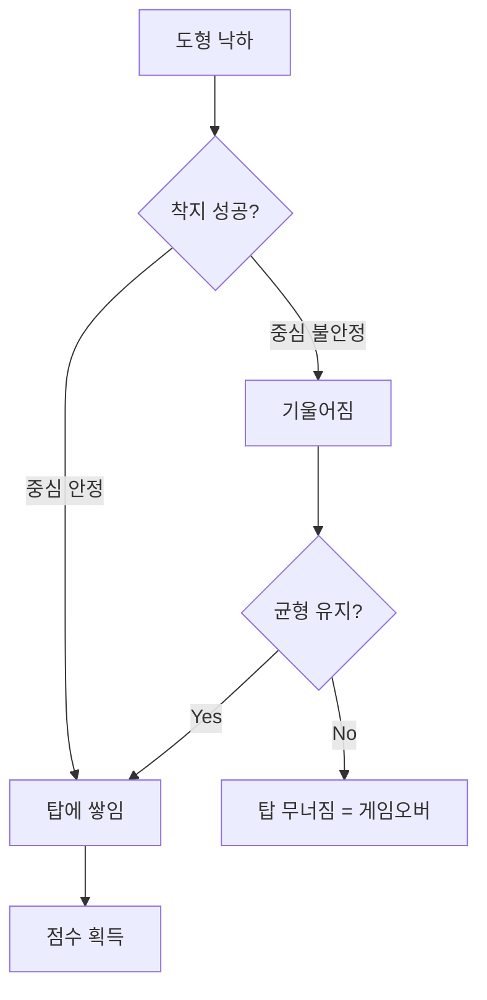

# 🏗️ 탑 쌓기 게임 (Block Tower) 기획서

## 개요

상단에서 좌우로 이동하는 슈터에서 도형을 떨어뜨려, **하나의 착지 영역** 위에 도형을 아슬아슬하게 쌓아 올리는 물리 기반 밸런스 게임입니다.

---

## 핵심 재미 요소

1. **아슬아슬한 균형 잡기** - 무게중심을 잘 맞춰야 탑이 무너지지 않음
2. **타이밍의 긴장감** - 슈터가 움직이는 중 정확한 순간에 탭해야 함
3. **전략적 선택** - 큰 도형 vs 작은 도형, 안정성 vs 점수

---

## 게임 메카닉

```
┌─────────────────────────────────┐
│  점수: 1,250      높이: 12m     │
├─────────────────────────────────┤
│         ◀ [▪▪▪] ▶              │  ← 슈터 (좌우 이동)
│              ↓                  │
│              ↓ (낙하 중)        │
│                                 │
│            ┌───┐                │  ← 쌓인 도형들
│          ┌─┴───┴─┐              │     (물리 엔진 적용)
│        ┌─┴───────┴─┐            │
│      ┌─┴───────────┴─┐          │
│   ═══════════════════════       │  ← 착지 영역 (하나)
└─────────────────────────────────┘
```

### 1. 슈터 (Shooter)

| 항목   | 설명                         |
| ------ | ---------------------------- |
| 위치   | 화면 상단                    |
| 움직임 | 좌우 자동 왕복 (핑퐁)        |
| 속도   | 시간 경과에 따라 점점 빨라짐 |
| 표시   | 현재 들고 있는 도형 미리보기 |

### 2. 도형 (Blocks)

| 도형             | 크기   | 무게   | 쌓기 난이도 |
| ---------------- | ------ | ------ | ----------- |
| ▫ 소형 정사각형  | 40×40  | 가벼움 | 쉬움        |
| ▪ 중형 정사각형  | 60×60  | 보통   | 보통        |
| ⬛ 대형 정사각형 | 80×80  | 무거움 | 안정적      |
| ▬ 소형 직사각형  | 80×30  | 가벼움 | 균형 어려움 |
| █ 대형 직사각형  | 120×40 | 무거움 | 넓어서 유리 |

> **무게 시스템**: 큰 도형일수록 무거움 → 아래에 두면 안정적, 위에 두면 무너질 위험

### 3. 착지 영역 (Landing Zone)

- **개수**: 1개 (중앙 고정)
- **너비**: 화면의 약 40%
- **바닥**: 고정된 플랫폼 (물리 충돌 적용)

---

## 물리 시스템



- **Matter.js 물리 엔진** 사용 (Phaser 내장)
- 도형 간 마찰력, 반발력 적용
- 무게 중심에 따른 자연스러운 기울어짐

---

## 점수 시스템

| 액션                     | 점수      |
| ------------------------ | --------- |
| 도형 착지 성공           | +10       |
| Perfect 착지 (중앙 ±5px) | +30       |
| 높이 보너스 (5층마다)    | +50       |
| 연속 Perfect (콤보)      | ×1.5 배율 |

---

## 난이도 진행

| 시간    | 슈터 속도 | 도형 종류               |
| ------- | --------- | ----------------------- |
| 0~20초  | 느림      | 대형 도형 위주          |
| 20~40초 | 보통      | 중/대형 혼합            |
| 40초+   | 빠름      | 소형 포함 (균형 어려움) |

---

## 게임오버 조건

1. **탑 무너짐** - 도형이 착지 영역 밖으로 떨어짐
2. **낙하 실패** - 도형이 탑에 닿지 않고 화면 밖으로 떨어짐

---

## 조작

| 플랫폼 | 조작                |
| ------ | ------------------- |
| 모바일 | 화면 아무 곳이나 탭 |
| PC     | 클릭 / 스페이스바   |

---

## 다음 단계

승인 시 구현을 시작합니다.
