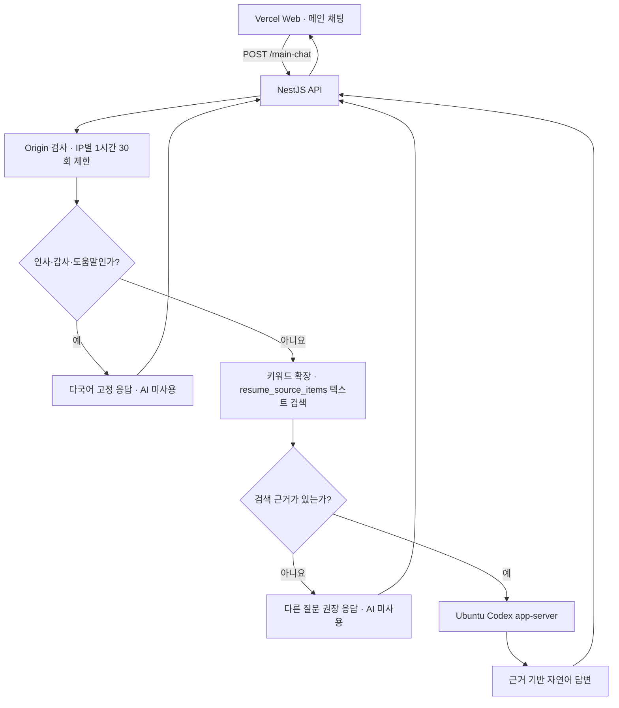

# 메인 채팅·이력 질문 AI 사용 지침

확인 기준일: 2026-08-20

## 1. 목적과 범위

이 문서는 VSCoke 메인 화면의 `POST /main-chat`이 AI를 사용하는 범위와 배포 운영 기준을
정의한다. 메인 채팅은 프로젝트 설명과 이력서 질문을 하나의 화면에서 받지만, 모든 요청을
AI에 전달하는 범용 챗봇은 아니다.

핵심 원칙은 다음과 같다.

- 브라우저는 VSCoke API만 호출하고 Codex app-server에 직접 연결하지 않는다.
- AI는 DB에서 검색된 공개 이력 근거를 자연어 답변으로 정리할 때만 사용한다.
- 키워드 확장과 근거 검색은 API가 결정론적으로 처리한다.
- 검색 근거가 없으면 AI가 추측해서 답하지 않는다.
- 모델 이름은 코드에 고정하지 않는다. `RAG_CHAT_MODEL`이 비어 있으면 app-server의 기본
  모델을 사용한다.

## 2. 전체 구조



배포 연결 방향은 다음으로 고정한다.

```text
브라우저
-> https://api.icecoke.kr/main-chat
-> Ubuntu의 NestJS API
-> ws://127.0.0.1:14561의 Codex app-server
```

Codex app-server 주소와 인증 정보는 브라우저 번들, Vercel 환경 변수 또는 API 응답에
노출하지 않는다.

## 3. 요청 처리 단계

### 3.1 Web

- 현재 페이지의 `locale`과 사용자 질문만 API에 전송한다.
- 응답의 `answer`, `grounded`, `sources`와 rate-limit 헤더를 검증해 화면에 표시한다.
- 화면에 보이는 메시지는 브라우저 메모리에만 유지한다.
- 이전 메시지 목록은 다음 질문과 함께 API에 보내지 않는다.

### 3.2 Main Chat API

- `ResumeRagOriginGuard`가 허용된 웹 origin인지 확인한다.
- `MainChatRateLimitGuard`가 이력서 전용 채팅과 별도로 IP당 최근 1시간 30회를 제한한다.
- 이력 질문 `POST /resume-rag/chat`은 IP당 최근 1시간 20회를 제한한다.
- 인사, 감사, 도움말처럼 명시적으로 등록된 짧은 문구는 다국어 고정 응답을 반환한다.
- 고정 응답이 아니면 기존 `ResumeRagService`에 질문을 전달한다.
- 메인 채팅 질문은 `recordQuestion: false`로 처리해 이력 질문 로그에 저장하지 않는다.

### 3.3 키워드 확장과 근거 검색

- `ResumeRagKeywordService`는 질문을 차단하지 않고 프로젝트·기술·경력 키워드를 검색
  토큰으로 확장한다.
- 모든 고정 응답 외 질문은 `resume_source_items`에서 다음 조건을 만족하는 자료를 검색한다.
  - `status = active`
  - `vectorize = true`
  - `visibility`가 `RAG_ALLOWED_VISIBILITIES`에 포함됨
  - 요청 locale과 같거나 공용 자료임
- 현재 운영 검색은 임베딩 모델이 아니라 키워드 확장과 텍스트 점수 기반이다.
- 점수가 `RAG_MIN_SIMILARITY` 이상인 상위 `RAG_TOP_K`개 근거만 AI에 전달한다.
- 검색 근거가 없으면 프로젝트·기술 경험·업무 성과 등 다른 질문을 권장한다.

### 3.4 Codex app-server

검색 근거가 있을 때 API는 요청마다 다음 순서로 app-server를 호출한다.

1. JSON-RPC 연결 초기화
2. 임시 thread 생성
3. 질문, locale, 검색 근거와 답변 제약 전달
4. 답변 이벤트 수신
5. thread 연결 종료

AI에 적용되는 제약은 다음과 같다.

- 검색된 이력 근거만 사용한다.
- 근거가 부족하면 부족하다고 답한다.
- 내부 검색 방식, 모델 또는 provider 설정을 답변에 노출하지 않는다.
- thread는 `ephemeral`이며 이전 대화를 기억하지 않는다.
- approval은 `never`, sandbox는 `read-only`, network access는 `false`다.
- 환경 변수와 dynamic tool을 전달하지 않는다.
- 모델은 `RAG_CHAT_MODEL`, 추론 강도는 `RAG_CODEX_REASONING_EFFORT`를 따른다.

따라서 현재 메인 채팅은 UI상 여러 메시지를 보여주지만, AI 관점에서는 질문마다 독립된
**단일 턴 RAG**다. 후속 질문에서 이전 대화 맥락을 자동으로 이해하지 않는다.

## 4. AI를 호출하는 경우와 호출하지 않는 경우

| 요청 상태                      | AI 호출      | 응답 상태                                |
| ------------------------------ | ------------ | ---------------------------------------- |
| 등록된 인사·감사·도움말        | 하지 않음    | `grounded: false`, `sources: []`         |
| 검색 근거 없음                 | 하지 않음    | locale별 다른 질문 권장 응답             |
| 검색 근거 있음                 | 호출함       | 정상 시 `grounded: true`, 근거 목록 포함 |
| app-server 연결 또는 생성 실패 | 시도 후 실패 | API `503 Service Unavailable`            |

인사 응답이 자연스럽다는 이유만으로 AI 연결이 정상이라고 판단하면 안 된다. 운영 점검에는
반드시 검색 근거가 존재하는 프로젝트 질문을 사용한다.

## 5. 배포 환경 설정

Ubuntu API 환경에는 최소한 다음 값을 설정한다.

```dotenv
RAG_CHAT_PROVIDER=codex-app-server
RAG_CODEX_APP_SERVER_URL=ws://127.0.0.1:14561
RAG_CODEX_CWD=/home/icenux/projects/vscoke-api
RAG_CODEX_TIMEOUT_MS=120000
RAG_CODEX_REASONING_EFFORT=low
RAG_PUBLIC_CHAT_ORIGINS=https://vscoke.icecoke.kr
RAG_ALLOWED_VISIBILITIES=public
```

선택 설정:

- `RAG_CHAT_MODEL`: 비워두면 app-server 기본 모델을 사용한다.
- `RAG_CODEX_MODEL_PROVIDER`: 별도 provider 힌트가 필요할 때만 설정한다.
- `RAG_TOP_K`: 기본값 `5`다.
- `RAG_MIN_SIMILARITY`: 기본값 `0.1`이다.
- `RAG_EMBEDDING_PROVIDER`, `RAG_EMBEDDING_MODEL`, `RAG_EMBEDDING_DIMENSIONS`,
  `RAG_AI_BASE_URL`, `RAG_AI_API_KEY`: 선택적 벡터 인덱싱을 다시 사용할 때만 설정한다.
- `RAG_CHUNK_SIZE`, `RAG_CHUNK_OVERLAP`: 선택적 source item chunking 설정이다.

운영 채팅은 DB 텍스트 검색을 사용하므로 `RAG_AI_API_KEY`, 임베딩 provider, 임베딩 모델을
필수로 요구하지 않는다. 환경 변수를 변경한 뒤에는 PM2를 `--update-env`로 재시작한다.

## 6. app-server 운영 기준

현재 API adapter는 loopback WebSocket listener를 전제로 한다.

```bash
codex app-server --listen ws://127.0.0.1:14561
```

- listener는 반드시 `127.0.0.1`에만 바인딩한다.
- API와 app-server는 같은 Ubuntu 호스트에서 실행한다.
- app-server 인증 상태와 프로세스 생명주기는 API와 별도로 관리한다.
- API 시작 전에 app-server를 시작하고, 장애 시 자동 재시작되도록 운영 프로세스 관리에
  포함한다.
- 준비 상태는 Ubuntu 호스트 내부에서 `GET http://127.0.0.1:14561/readyz`로 확인한다.
- app-server port를 Cloudflare Tunnel, 방화벽 또는 public DNS에 노출하지 않는다.

> 주의: [OpenAI 공식 Codex App Server 문서](https://learn.chatgpt.com/docs/app-server)는
> app-server 명령과 WebSocket transport를 experimental이며 production workload에 지원되지
> 않는 기능으로 명시한다. 현재 구조로 운영 배포하려면 이 제약을 릴리스 위험으로 승인하고
> Codex 버전 고정, 회귀 테스트, 장애 fallback을 준비해야 한다. 지원 안정성이 우선이면
> Codex SDK 또는 OpenAI API 기반 provider로 전환을 별도 설계한다.

## 7. 보안과 데이터 원칙

- 공식 웹 origin 외 요청을 허용하지 않는다.
- app-server는 loopback 외부에 공개하지 않는다.
- AI에는 검색된 공개 이력 근거와 현재 질문만 전달한다.
- 비공개 문서, 서버 환경 변수, 사용자별 세션 정보는 prompt context에 넣지 않는다.
- `RAG_ALLOWED_VISIBILITIES`는 기본적으로 `public`만 사용한다.
- 검색 근거 없이 일반 지식이나 추측으로 답하도록 prompt를 완화하지 않는다.
- 메인 채팅에 대화 저장을 추가하려면 보존 기간, 삭제 정책, 개인정보 범위를 먼저 문서화한다.

## 8. 분석과 질문 로그

이력 질문 화면은 다음 `dataLayer` 이벤트를 사용한다.

| 이벤트                                | 발생 시점                          |
| ------------------------------------- | ---------------------------------- |
| `resume_readme_viewed`                | README 이력 페이지 진입            |
| `resume_chat_page_viewed`             | 이력 질문 페이지 진입              |
| `resume_rag_chat_composer_focused`    | 질문 입력창 첫 focus               |
| `resume_rag_chat_opened`              | 모바일 README에서 질문 페이지 열기 |
| `resume_rag_chat_topic_expanded`      | 추천 질문 주제 펼치기              |
| `resume_rag_chat_suggestion_selected` | 추천 질문 선택                     |
| `resume_rag_chat_submitted`           | 질문 API 전송                      |
| `resume_rag_chat_completed`           | 답변 수신                          |
| `resume_rag_chat_failed`              | API 또는 응답 계약 실패            |
| `resume_rag_chat_answer_viewed`       | README에서 준비한 답변 보기        |

공통 parameter는 `chat_entry_point`, `chat_locale`, `chat_keyword`, `chat_question_length`다. 완료
이벤트에는 `chat_evidence`, `chat_source_count`, 실패 이벤트에는 `chat_failure_reason`, 추천 주제
이벤트에는 `chat_topic_index`를 추가한다. 질문 원문, IP 주소와 계정 식별자는 보내지 않는다.

GTM에서는 이벤트별 Custom Event trigger와 같은 이름의 GA4 Event 태그를 만들고 Data Layer
Variable을 parameter로 매핑한다. `chat_keyword`, `chat_entry_point`, `chat_evidence`,
`chat_failure_reason`은 event-scoped custom dimension으로 등록한다. `NEXT_PUBLIC_GTM_ID` 없이
GA만 연결하면 같은 이벤트를 `gtag`로 보내고, GA와 GTM을 함께 설정하면 GTM 경로만 사용한다.

새 키워드는 `resume-rag-chat-analytics.ts`의 허용 목록에 정규화 값과 matcher를 추가한다. 점검
모드에서 차단된 요청은 전송·완료·실패 이벤트를 만들지 않는다.

`resume_rag_chat_logs`에는 origin·DTO 검증을 통과한 이력 질문을 답변 처리 전에 기록한다. 이메일,
전화번호, Bearer/API key·token·secret은 마스킹하고 동일한 마스킹 결과의 반복 수는
`questionHash`로 집계한다. 메인 채팅 질문은 이 로그에 저장하지 않는다.

최근 질문은 다음 조회로 확인한다.

```sql
SELECT "createdAt", "locale", "questionText"
FROM "resume_rag_chat_logs"
ORDER BY "createdAt" DESC
LIMIT 100;
```

## 9. 배포 검증 체크리스트

1. Ubuntu에서 Codex CLI 인증과 app-server 실행 계정을 확인한다.
2. app-server를 loopback listener로 실행한다.
3. `curl http://127.0.0.1:14561/readyz`가 `200`인지 확인한다.
4. 운영 DB에 검색 가능한 공개 자료가 있는지 확인한다.

   ```sql
   SELECT count(*)
   FROM resume_source_items
   WHERE status = 'active'
     AND vectorize = TRUE
     AND visibility = 'public';
   ```

5. API 환경 변수를 설정하고 PM2를 `--update-env`로 재시작한다.
6. 인사 질문이 `grounded: false`로 응답하는지 확인한다.
7. 근거가 있는 프로젝트 질문이 `grounded: true`이고 `sources`를 포함하는지 확인한다.
8. app-server를 잠시 중단했을 때 근거가 있는 질문이 `503`으로 실패하는지 확인한다.
9. 허용되지 않은 origin은 `403`, 한도 초과 요청은 `429`인지 확인한다.

운영 검증 예시:

```bash
curl --fail-with-body --request POST https://api.icecoke.kr/main-chat \
  --header 'Content-Type: application/json' \
  --header 'Origin: https://vscoke.icecoke.kr' \
  --data '{"question":"Oprimed 프로젝트에서 맡은 역할과 성과를 알려줘","locale":"ko-KR"}'
```

정상적인 AI 답변은 HTTP `200`, `grounded: true`, 하나 이상의 `sources`를 반환해야 한다.

## 10. 장애 판단

| 증상                                             | 우선 확인                                                  |
| ------------------------------------------------ | ---------------------------------------------------------- |
| 인사는 되지만 프로젝트 질문이 근거 부족으로 끝남 | source import 상태, keyword, locale, visibility, 검색 점수 |
| 근거가 있는 질문이 `503`                         | app-server 프로세스, `/readyz`, API 환경 변수, timeout     |
| `403`                                            | `Origin`, `RAG_PUBLIC_CHAT_ORIGINS`, CORS 설정             |
| `429`                                            | 메인 채팅 독립 rate limit과 reset 시각                     |
| 답변 언어가 요청 locale과 다름                   | locale 전달값과 app-server prompt                          |
| 답변에 근거 밖 내용이 포함됨                     | 전달 context와 provider prompt 변경 이력                   |

## 11. 변경 지침

- Web에서 Codex app-server를 직접 호출하는 경로를 추가하지 않는다.
- 고정 응답, 검색, AI 답변 생성의 책임을 섞지 않는다.
- prompt를 변경하면 `codex-app-server.provider.spec.ts`와 `resume-rag.service.spec.ts`를
  검증한다.
- 응답 DTO를 변경하면 OpenAPI와 Web 생성 타입을 함께 갱신한다.
- 모델 변경은 우선 환경 변수로 수행하고 코드 기본 모델을 추가하지 않는다.
- multi-turn 대화를 도입할 때는 기존 메시지 전송 범위, token 한도, 개인정보 저장 정책,
  prompt injection 방어를 별도 사양으로 먼저 정의한다.

## 12. 구현 기준 파일

- Web 요청: `apps/web/src/features/main-chat/lib/main-chat-service.ts`
- Web 상태: `apps/web/src/features/main-chat/lib/main-chat-state.ts`
- Main API: `apps/api/src/main-chat/main-chat.controller.ts`
- 고정 응답과 RAG 분기: `apps/api/src/main-chat/main-chat.service.ts`
- 검색 결과와 근거 답변: `apps/api/src/resume-rag/resume-rag.service.ts`
- DB 검색: `apps/api/src/resume-rag/resume-rag-retriever.service.ts`
- Codex JSON-RPC adapter: `apps/api/src/resume-rag/ai/codex-app-server.provider.ts`
- 환경 설정: `apps/api/src/resume-rag/resume-rag.config.ts`
- 배포 환경 기준: `docs/deployment-and-env.md`
