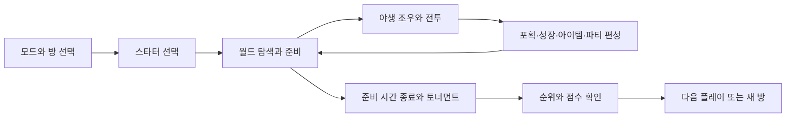
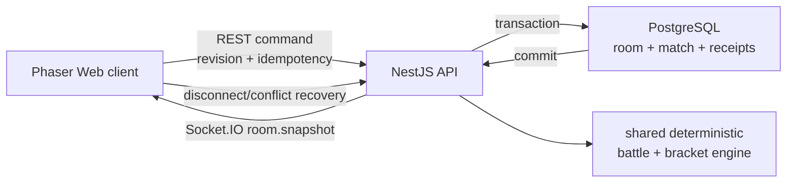

# Poke Lounge Game Concept

확인 기준일: 2026-07-16
구현 기준: `codex/fix/poke-lounge-five-player-tournament` (`a0ab579`)

이 문서는 Poke Lounge의 플레이 경험, 게임 규칙, 멀티플레이 구조와 현재 제품 경계를 한곳에 정리한 기준 문서다. 사용자에게 보이는 게임 컨셉을 먼저 설명하고, 그 컨셉을 지탱하는 서버 권위·저장·검증 구조를 뒤에서 연결한다.

Poke Lounge는 비공식 Pokémon 팬 게임이다. 기술 구현이 완료됐거나 배포 빌드가 통과했다는 사실은 Pokémon 관련 명칭·표장·데이터·에셋의 공개 사용 권리를 의미하지 않는다. 현재 공개 출시 권리 상태는 [Poke Lounge Release Gate](./poke-lounge-release-gate.md) 기준 `UNRESOLVED`다.

## 한 문장 컨셉

성도 스타터와 함께 작은 라운지 마을에서 야생 포켓몬을 포획·육성하는 탐색 루프와, 최대 6인의 순차 싱글 엘리미네이션을 한 세션에 결합한 브라우저형 포켓몬 팬 게임이다.

## 제품 정체성

Poke Lounge는 장편 RPG나 MMO보다 짧은 세션의 **탐색·육성·대전 루프**에 집중한다. VSCoke 안에서는 가볍게 플레이할 수 있는 게임인 동시에, 브라우저 게임 상태와 서버 권위 경쟁 규칙을 함께 다루는 기술적 MVP 역할을 한다.

| 설계 축            | 의도                                                                      |
| ------------------ | ------------------------------------------------------------------------- |
| 브라우저 접근성    | 설치 없이 데스크톱 키보드와 모바일 터치로 바로 시작한다.                  |
| 준비와 승부        | 월드 활동과 제한된 준비 시간, 이어지는 대진을 한 세션 루프로 묶는다.      |
| 익숙한 전투 감각   | Gen 4풍 턴제 전투, 타입 상성, PP, 상태 이상, 포획과 성장 경험을 제공한다. |
| 소규모 소셜 플레이 | 친구 2~6명이 방 코드로 참가·파티·토너먼트 상태를 공유한다.                |
| 결과 신뢰 분리     | 캐주얼 결과와 서버가 검증한 공개 랭킹 결과를 섞지 않는다.                 |

주요 대상은 다음과 같다.

- 혼자 짧게 탐색·포획·육성을 즐기려는 사용자
- 2~6명이 방 코드를 공유해 작은 토너먼트를 진행하려는 친구 그룹
- 데스크톱과 모바일 브라우저에서 같은 게임 흐름을 경험하려는 사용자
- Web, API, PostgreSQL과 실시간 동기화가 결합된 게임 구조를 확인하려는 VSCoke 방문자

## 핵심 플레이 루프



1. 사용자는 혼자 시작하거나 로컬·서버 방을 만들고 참가한다.
2. 저장된 파티가 없다면 치코리타, 브케인, 리아코 중 Lv.10 스타터 한 마리를 고른다.
3. 마을을 이동하며 야생 포켓몬과 싸우고, 포획하고, 경험치와 돈을 얻는다.
4. 간호사, 상점, PC 박스와 주사위 게임을 이용해 파티와 자원을 정비한다.
5. 서버 방에서는 준비 시간이 끝나면 서버가 참가자와 대진을 확정한다.
6. 매치를 한 경기씩 진행하고, 토너먼트 종료 후 순위와 점수를 확인한다.

현재 서버 권위전은 필드에서 육성한 파티가 아니라 고정 Lv.50 loadout을 사용한다. 탐색·육성과 토너먼트가 같은 세션에 존재하지만, 육성 결과가 서버 권위 전투 능력치로 이어지는 구조는 아직 아니다.

솔로 모드는 현재 월드 탐색·야생전·성장 루프에 집중하며 토너먼트 타이머를 시작하지 않는다. 서버 방은 준비 시간 뒤 한 번의 싱글 엘리미네이션 bracket을 완료하면 최종 결과로 끝난다. Web 내부에는 3라운드 로컬 흐름도 남아 있지만 현재 서버 운영 컨셉을 “3회 토너먼트”로 해석하지 않는다.

## 게임 모드

| 모드             |                        참가 | 상태 권위                           | 공개 랭킹 | 현재 위치                                   |
| ---------------- | --------------------------: | ----------------------------------- | --------- | ------------------------------------------- |
| 솔로             |                         1명 | 브라우저 로컬 상태                  | 제외      | 탐색·야생전·성장 플레이                     |
| 로컬 방          |                    최대 6명 | `BroadcastChannel` 기반 클라이언트  | 제외      | 같은 브라우저 프로필의 개발·미리보기        |
| 수동 WebRTC      |                    2명 중심 | 수동 signal 교환 클라이언트         | 제외      | 일반 진입 UI에 없는 실험 경로               |
| 서버 방 캐주얼   |                       2~6명 | 서버 bracket + client-asserted 결과 | 제외      | 결과 API는 있으나 브라우저 전투 진입 미완성 |
| 서버 1:1 경쟁전  |               인증 계정 2명 | 서버 전투 엔진                      | 포함      | `ranked-head-to-head`                       |
| 서버 다인 경쟁전 | 전체 3~6명, active 2명 인증 | 서버 전투 엔진                      | 제외      | `tournament-unranked`                       |

서버 방은 캐주얼과 경쟁전으로 별도 생성되지 않는다. 현재 active match의 두 참가자가 서로 다른 인증 계정으로 경쟁 좌석을 모두 바인딩하면 그 매치만 서버 권위로 승격된다. 좌석이 준비되지 않은 매치에는 캐주얼 결과 제출 API가 적용되며, 두 결과 경로를 같은 active match에 동시에 제출할 수 없다. 다만 현재 서버 snapshot은 원격 참가자의 전투 파티를 전달하지 않아 Web 클라이언트가 캐주얼 원격전을 시작하는 종단 경로는 완성되지 않았다.

서버 방 lifecycle은 `waiting → round-started(준비) → tournament → completed`다. 연결된 participant가 2명 이상이고 모두 ready이면 준비 시간이 시작된다. 생성 UI에서는 3·5·10·15분 중 선택하며 기본값은 5분이다. 토너먼트 중 active participant가 나가면 해당 match는 forfeit로 처리되고, 연결된 participant가 모두 사라지면 방은 `closed`로 전환된다.

## 월드와 탐색

현재 월드는 단일 `town` 맵이다. 플레이어는 픽셀 아트 마을에서 충돌 타일, 조우 지역과 NPC 상호작용 지점을 탐색한다. 로컬 방과 WebRTC는 원격 참가자의 이동을 같은 맵에 표시한다. 서버 방은 참가·대표 파티·토너먼트 상태를 공유하지만 현재 원격 참가자의 실시간 필드 이동은 중계하지 않는다.

주요 상호작용은 다음과 같다.

- 간호사: 현재 파티 전체의 HP, PP와 상태를 무료 회복
- 일반 상점: 기본 회복·포획 아이템 판매
- 희귀 상점: 랭크 조건이 있는 고급 아이템 판매
- 보관 PC: 파티와 박스 사이 포켓몬 이동·교환
- 게임 진행자: ₽100을 거는 주사위 예측 게임
- 야생 지역: 이동이 완료된 타일 단위로 지역별 조우 판정

야생 조우 기본 확률은 정상적인 타일 이동 한 번당 15%다. 출현 포켓몬과 가중치는 서쪽, 광장, 남쪽 지역에 따라 달라지며 야생 레벨은 현재 파티 평균 레벨을 중심으로 약 ±5 범위에서 보정된다.

| 지역      | 대표 출현 구성                         |
| --------- | -------------------------------------- |
| 서쪽 필드 | 캐터피·구구·꼬렛, 낮은 확률의 이상해씨 |
| 광장 필드 | 구구·꼬렛, 낮은 확률의 파이리·꼬부기   |
| 남쪽 필드 | 꼬렛·캐터피, 낮은 확률의 브케인·리아코 |

## 파티, 성장과 경제

파티는 최대 6마리다. 파티가 가득 찬 상태에서 포획한 포켓몬은 PC 박스로 이동하며, 사용자는 필드 PC에서 파티와 박스를 관리할 수 있다. 마지막 파티 포켓몬을 박스로 보내거나 쓰러진 포켓몬을 선두로 지정하는 동작은 제한된다.

야생전에서 이기거나 포획하면 다음 진행이 발생한다.

- 경험치 획득과 최대 Lv.100까지 레벨 상승
- 레벨에 따른 능력치 재계산
- 레벨업 기술 학습과 최대 4개 기술 교체 선택
- 지원되는 레벨 진화 규칙과 진화 연출
- 상대의 기본 경험치와 레벨에 비례한 포켓달러 획득
- 포획 시 쓰러뜨린 경우의 절반 수준 포켓달러 보상

상점 구성은 랭크에 따라 확장된다.

| 상점 | 아이템     |   가격 | 해금 조건 |
| ---- | ---------- | -----: | --------: |
| 일반 | 포션       |   ₽300 |      기본 |
| 일반 | 몬스터볼   |   ₽200 |      기본 |
| 일반 | 해독제     |   ₽100 |    랭크 2 |
| 일반 | 좋은상처약 |   ₽700 |    랭크 3 |
| 희귀 | 고급상처약 | ₽1,500 |    랭크 3 |
| 희귀 | 기력의조각 | ₽3,000 |    랭크 4 |
| 희귀 | 하이퍼볼   | ₽2,500 |    랭크 4 |
| 희귀 | 이상한사탕 | ₽8,000 |    랭크 6 |

주사위 게임은 기준 숫자보다 결과가 낮을지, 같을지, 높을지를 예측한다. 경우의 수가 적은 선택일수록 성공 보상이 커지는 확률 비례 배당을 사용한다.

## 전투 모델

Poke Lounge에는 목적이 다른 두 전투 규칙이 공존한다.

| 구분 | 야생·캐주얼 전투                | 서버 권위 경쟁전               |
| ---- | ------------------------------- | ------------------------------ |
| 파티 | 사용자가 포획·육성한 최대 6마리 | 고정 Lv.50 2마리 loadout       |
| 명령 | 싸운다·가방·포켓몬·도망         | 기술 사용·교체                 |
| 계산 | Gen 4풍 브라우저 규칙           | 버전·hash가 고정된 결정론 엔진 |
| 난수 | 브라우저 전투 흐름              | 서버 seed와 turn 기반 PRNG     |
| 결과 | 클라이언트 상태에 반영          | 서버가 HP·상태·승패·점수 확정  |
| 랭킹 | 공개 랭킹 근거 아님             | 인증 1:1만 공개 랭킹 근거      |

### 야생·캐주얼 전투

기본 명령은 `싸운다 / 가방 / 포켓몬 / 도망`이다. 기술은 최대 4개와 PP를 가지며, 물리·특수·상태 분류를 사용한다.

전투 계산에는 다음 요소가 포함된다.

- 스피드 기반 행동 순서
- 명중·회피 단계와 급소
- STAB와 Gen 4 타입 상성
- 85~100% 대미지 난수
- 공격·방어·스피드·명중률 단계 변화
- 독·화상·마비·전투불능 상태와 턴 종료 피해
- 포켓몬 교체, 회복·상태·부활 아이템
- 야생 포켓몬 포획과 도주 판정

포획은 상대 HP, 종족 포획률과 볼 배율을 반영하는 Gen 4식 네 번의 흔들림 판정을 사용한다. 트레이너전에서는 포획과 도주가 제한된다. 포획·도주 실패 또는 아이템 사용은 상대 행동 기회를 소비한다.

### 서버 권위 경쟁전

서버 권위전은 공정한 상태 전진을 검증하기 위한 고정 규칙 세트다. 양쪽은 같은 Lv.50 2마리 loadout을 사용하며 `steady-strike`, `stun-spark`, `heavy-blow` 기술과 마비 규칙을 공유한다.

각 인증 계정은 자신에게 바인딩된 player의 현재 turn 행동만 제출할 수 있다. 서버는 다음 순서와 난수 소비 순서를 고정한다.

1. 교체 행동 적용
2. 스피드와 동률 판정
3. 마비 행동 불가 판정
4. 명중, 급소, 대미지 범위와 부가 효과 판정
5. HP·PP·상태·교체 필요 상태와 terminal 판정

포켓몬이 쓰러지면 서버가 자동 교체하지 않는다. 해당 플레이어가 다음 turn에 유효한 포켓몬으로 `switch` 행동을 직접 제출해야 한다.

클라이언트는 승자, 패자, 점수나 terminal을 권위 입력으로 제출하지 않는다. 서버가 terminal에서 승자 100점, 패자 50점을 확정한다.

현재 서버 권위전은 월드에서 육성한 파티를 사용하지 않는다. 따라서 “탐색에서 만든 파티가 그대로 경쟁력이 된다”는 장기 게임 판타지와 고정 loadout 경쟁전 사이에는 제품 간극이 남아 있다.

## 토너먼트와 점수

토너먼트는 2~6인 싱글 엘리미네이션이다. 서버가 참가 순서와 player ID를 기준으로 seed를 확정하고 canonical bracket과 부전승을 생성한다. Web은 서버 bracket을 표시할 뿐 참가자 배열로 대진을 다시 계산하지 않는다.

5인 첫 대진은 다음과 같다.

```text
seed 4 ─┐
        ├─ 첫 active match의 승자 ─┐
seed 5 ─┘                           ├─ 다음 단계
seed 1 ─────────────── bye ─────────┘

seed 3 ─────────────── bye ─┐
                            ├─ 다음 단계
seed 2 ─────────────── bye ─┘
```

여러 ready match를 동시에 열지 않고 서버가 한 경기씩 순차 활성화한다. 5인 경기에서 seed 5가 첫 매치를 이기면 다음 ready match는 `seed 1 vs seed 5`, 이어서 `seed 3 vs seed 2` 순서다. 6명을 초과해 참가한 사용자는 spectator가 되며 ready와 party 갱신 권한을 갖지 않는다.

방 내부 토너먼트 순위 점수는 다음과 같다.

| 순위 | 점수 |
| ---: | ---: |
|  1위 |  100 |
|  2위 |   70 |
|  3위 |   45 |
|  4위 |   30 |
|  5위 |   15 |
|  6위 |    5 |

방 내부 누적 점수와 공개 Poke Lounge 랭킹 점수는 서로 다른 개념이다.

| 결과 경로                      | 신뢰 분류            | 저장·공유           | 공개 Poke Lounge 랭킹 |
| ------------------------------ | -------------------- | ------------------- | --------------------- |
| 일반 결과 API                  | `client-asserted`    | API 제출 가능       | 제외                  |
| 로컬·WebRTC 결과               | client/host asserted | 일반 결과 제출 가능 | 제외                  |
| 서버 방 casual `/result`       | unranked             | room 전진           | 제외                  |
| 3~6인 `tournament-unranked`    | 서버 권위            | bracket 전진        | 제외                  |
| 인증 2인 `ranked-head-to-head` | `verified-room`      | 서버 이력           | 포함                  |

공개 랭킹은 `verified-room` 결과만 먼저 필터링한 뒤 사용자별 최고 점수로 계산한다. 다인 토너먼트가 서버 권위 전투를 사용하더라도 현재는 의도적으로 공개 랭킹 이력을 만들지 않는다.

일반 결과 API 정책과 실제 솔로 플레이 흐름은 구분해야 한다. 현재 솔로 모드는 경쟁 라운드와 `game-result` 종료 상태를 사용하지 않으므로 월드 플레이에서 점수 결과를 제출하는 종단 경로가 없다.

## 멀티플레이와 상태 수렴

서버 방 상태의 원본은 PostgreSQL이다. REST는 명령과 최초·장애 복구를 담당하고 Socket.IO는 commit된 snapshot을 실시간으로 전달한다.



모든 일반 room mutation은 UUID v4 `X-Idempotency-Key`와 `If-Match-Revision`을 요구한다. 같은 key와 같은 요청은 저장된 응답을 재생하고, 같은 key에 다른 요청이나 오래된 revision은 충돌로 처리한다.

한 매치가 끝나는 transaction은 terminal metadata, bracket 전진, 다음 assignment와 적용 가능한 action·room-command receipt를 함께 확정한다. 공개 snapshot은 두 역할을 분리한다.

- `competitiveTransitions`: 완료된 이전 매치의 terminal transition 목록. 복구 시 cursor 이후 최대 8개
- optional `competitive`: 현재 진행해야 할 다음 assignment

Web은 이전 terminal을 먼저 적용해 양쪽 플레이어가 승리·패배 결과를 보게 한 뒤 현재 assignment를 적용한다. event ID와 match ID로 중복을 제거하고, 같은 페이지 reconnect에서는 마지막으로 안전하게 적용한 terminal revision 이후를 `afterRevision`으로 복구한다. 결과를 확인한 참가자는 월드로 돌아오며, 현재 다음 assignment에 포함된 참가자만 새 BattleScene을 정확히 한 번 시작한다. 그 외 참가자는 월드에서 다음 배정을 기다린다.

이 구조는 5명이 동시에 하나의 전투를 하는 모델이 아니다. 최대 6인 canonical bracket 안에서 정확히 두 명의 서버 권위 match를 순차 실행하는 모델이다.

## 계정, 저장과 복구

| 상태            | 저장 위치                  | 범위                                                      |
| --------------- | -------------------------- | --------------------------------------------------------- |
| 익명 플레이어   | versioned `sessionStorage` | 현재 탭의 파티·박스·재화·위치·단축키 안내 확인 상태       |
| 로그인 플레이어 | VSCoke API                 | 계정 단위 local-player snapshot                           |
| 서버 방         | PostgreSQL                 | room aggregate, revision, TTL, command receipt            |
| 경쟁 매치       | PostgreSQL                 | canonical battle state, action receipt, terminal metadata |

로그인 사용자는 Phaser를 시작하기 전에 저장 snapshot을 GET하고 검증·정규화한 뒤 한 번에 hydrate한다. 저장 데이터는 파티, 박스, 활성 슬롯, 돈, 인벤토리, 랭크·점수, 안내 확인 상태와 월드 위치를 포함한다.

자동 저장은 상태 변경 후 debounce, 주기 저장과 정상 종료 final flush를 조합한다. 인증 GET이 실패하면 로컬 상태로 게임은 열지만, 서버 상태를 오래된 로컬 값으로 덮어쓰지 않도록 복구 전까지 원격 autosave를 시작하지 않는다.

## 화면, 입력과 오디오

게임 캔버스는 4:3 비율을 유지하며 기본 512×384, 선택적 768×576 표시 크기를 사용한다. 전투 화면은 256×192 논리 좌표를 확대해 픽셀 아트와 ROM풍 전투 창을 표현한다.

데스크톱 기본 조작:

- 이동: `WASD` 또는 방향키
- 확인·대화: `Enter`, `Space`, `Z`
- 가방: `I`
- 도움말: `H`
- 뒤로: `Esc`, `Backspace`

모바일은 방향 패드와 `A`, `B`, `I`, `?` 터치 버튼을 제공한다. iPhone WebKit처럼 `maxTouchPoints = 0`으로 보고되는 환경도 mobile user agent와 coarse pointer를 함께 사용해 터치 UI를 판단한다.

주요 연출은 전투 전환, HP 감소 tween, 피격 흔들림·점멸, 쓰러짐과 진화 연출이다. 필드와 야생전 BGM, 확인·취소·전투 시작·피격·쓰러짐 효과음은 첫 사용자 입력 후 활성화되며 현재 런타임 오디오는 출처가 확인된 CC0 자산이다.

## 기술 구조

```text
apps/web
  Next.js route와 React wrapper
  Phaser BootScene / WorldScene / BattleScene
  local save, room adapter, UI와 입력

apps/api
  account save와 game history
  durable Poke Lounge room
  competitive seat/action와 Socket gateway

packages/poke-lounge-battle
  canonical state와 PRNG
  deterministic turn resolver
  2~6인 bracket과 순위 점수

PostgreSQL
  room aggregate와 command receipt
  competitive match/action와 verified history
```

Web과 API는 `@vscoke/poke-lounge-battle` 규칙을 공유한다. 브라우저는 상태를 표현하고 입력을 제출하며, 서버 권위 match의 state 전진은 API만 수행한다. API DTO에서 생성한 local OpenAPI JSON과 Web generated type이 두 앱 사이의 계약 기준이다.

현재 Socket event publisher에는 multi-instance fan-out adapter가 없다. PostgreSQL은 durable source지만 실시간 전파는 단일 API 인스턴스를 전제로 한다.

## 검증 전략과 현재 증거

검증 계층은 다음과 같다.

- 공통 엔진 unit: bracket, bye, scoring, canonical state, PRNG와 turn resolver
- Web unit: 저장 snapshot, 터치 감지, terminal cache, scene launch와 game state
- API unit·integration: room policy, idempotency, projection과 경쟁 service
- PostgreSQL E2E: migration, transaction rollback, receipt replay와 verified history
- Playwright: 스타터, 월드, 전투, 저장, 멀티플레이와 모바일 입력

최신 5환경 release gate는 실제 Nest API, PostgreSQL과 Socket.IO를 사용해 다음 context를 동시에 열었다.

| 테스터 | 환경                                | 입력·특징                         |
| -----: | ----------------------------------- | --------------------------------- |
|      1 | Desktop Chromium                    | keyboard, host, seed 1 bye        |
|      2 | Desktop Firefox                     | keyboard, cold reload, seed 2 bye |
|      3 | Desktop WebKit                      | keyboard, seed 3 bye              |
|      4 | Mobile Chromium / Pixel 7 emulation | touch, seed 4 첫 매치             |
|      5 | Mobile WebKit / iPhone 13 emulation | touch, seed 5 첫 매치             |

targeted 1회와 fresh release 3회가 모두 5/5 통과했다. 다섯 context는 테스트 전용 bootstrap의 서로 다른 `e2e-user-1`~`e2e-user-5` identity를 사용하며 실제 Google 계정이 아니다. 모바일 두 환경도 물리 기기가 아니라 Playwright device emulation이다. 검증 범위는 다섯 격리 identity 입장, `seed 4 vs 5`, 모바일 touch 권위 전투, 양쪽 브라우저의 이전 terminal 관측, Firefox reload·same-page reconnect와 다음 `seed 1 vs 승자` assignment 수렴까지다.

이 검증은 **5인 전체 토너먼트를 champion 확정까지 완주한 E2E가 아니다.** 첫 매치 종료부터 다음 assignment까지의 가장 위험한 수렴 경계를 검증한 release gate다. 실제 5브라우저 통합 실행은 격리 PostgreSQL이 필요한 로컬 gate이며 PR CI는 focused Chromium 회귀와 통합 spec 수집 조건을 담당한다.

## 현재 완료 범위

- 솔로 월드 탐색, 야생전, 포획, 성장, 상점, 인벤토리와 PC 박스
- 데스크톱 키보드와 모바일 터치 입력
- 로그인 계정 저장과 안전한 hydration·autosave
- PostgreSQL durable room, revision과 command receipt
- REST 복구와 Socket.IO committed snapshot
- 2~6인 canonical bracket과 부전승
- 순차 2인 서버 권위 match와 terminal→다음 assignment 수렴
- 인증 1:1 `verified-room` 공개 랭킹
- 5개 브라우저 context의 첫 매치→다음 배정 release 검증

## 현재 제약과 비목표

- 월드는 단일 마을이며 장거리 탐험, 퀘스트와 스토리 캠페인은 없다.
- 서버 방은 현재 한 세션당 한 bracket을 진행한다.
- 월드에서 육성한 파티와 서버 권위 경쟁전의 고정 loadout이 연결되지 않는다.
- 3~6인 서버 권위 토너먼트는 공개 랭킹 대상이 아니다.
- 운영형 로비, 친구 목록, 자동 matchmaking과 시즌 시스템은 없다.
- 여러 API 인스턴스 사이의 Socket fan-out은 지원하지 않는다.
- 수동 WebRTC는 개발·실험 경로이며 운영 멀티플레이로 취급하지 않는다.
- 인게임 문구는 대부분 한국어 중심이며 전체 다국어 게임 UI는 완료되지 않았다.
- 물리 iOS Safari와 실제 네트워크 품질에서의 장시간 human game-feel 검증은 별도다.
- 5인 전체 bracket 완주 E2E는 아직 없다.

## 공개 출시 조건

기술 상태와 권리 상태는 별도다. 현재 오디오 관련 provenance는 승인됐지만 Pokémon 이름·표장·게임 데이터, ROM-derived data, 스프라이트, 텍스처, character atlas, map material과 ported code의 배포 권리는 해결되지 않았다.

`pnpm check:poke-lounge-provenance`는 미해결 항목 때문에 의도적으로 실패한다. 기본 Vercel build가 이 상태를 자동 차단하지 않는 것은 권리 승인이 아니다. 공개 출시 전에는 다음이 필요하다.

1. 미해결 에셋의 교체·제거 또는 서면 권리 근거 확보
2. provenance manifest의 hash·source·attribution·reviewer 기록 완성
3. release owner 지정과 서명된 최종 결정
4. 필요한 법률·상표 검토

## 향후 확장 우선순위

다음 항목은 현재 구현이 아니라 제품 방향 제안이다.

1. 에셋과 코드의 권리 문제를 먼저 해결해 공개 출시 기준을 확정한다.
2. 육성 파티를 서버가 검증 가능한 loadout으로 변환해 탐색과 경쟁의 단절을 줄인다.
3. 5인 전체 bracket을 champion까지 완주하는 실제 브라우저 E2E를 추가한다.
4. 실제 5브라우저 gate를 CI 또는 예약 release workflow로 운영한다.
5. 로비, 초대 상태, 재입장과 matchmaking UX를 제품화한다.
6. 다인 랭킹이 필요하면 시즌, 동률, 이탈, 부정행위와 보상 정책을 별도로 설계한다.
7. 권리 정리된 신규 맵, NPC, 퀘스트와 콘텐츠 데이터를 추가한다.

## Source of truth

| 주제                    | 기준 문서·코드                                                                                                    |
| ----------------------- | ----------------------------------------------------------------------------------------------------------------- |
| 전체 모노레포 구조      | [VSCoke Monorepo Concept](./vscoke-monorepo-concept.md)                                                           |
| 저장·룸·경쟁 구현       | [Poke Lounge Hardening Report](./poke-lounge-hardening-report.md)                                                 |
| terminal 수렴 완료 상태 | [Terminal Client Convergence Plan](./superpowers/plans/2026-07-16-poke-lounge-terminal-client-convergence-fix.md) |
| 점수와 공개 랭킹        | [Game Score Policy](./game-score-policy.md)                                                                       |
| 공개 출시 권리          | [Poke Lounge Release Gate](./poke-lounge-release-gate.md)                                                         |
| 에셋 인벤토리           | [Poke Lounge Asset Provenance](./poke-lounge-asset-provenance.md)                                                 |
| 월드·전투 runtime       | `apps/web/src/components/poke-lounge/runtime/game/`                                                               |
| 서버 room과 경쟁전      | `apps/api/src/poke-lounge/`                                                                                       |
| 공통 전투·대진 규칙     | `packages/poke-lounge-battle/`                                                                                    |
| 5환경 검증              | `apps/web/tests/e2e/poke-lounge-five-player-tournament.spec.ts`                                                   |

세부 기술 문서와 현재 코드가 이 문서와 충돌하면 다음 우선순위로 판단한다.

1. 현재 실행 코드와 migration
2. 2026-07-16 terminal 수렴 완료 기록
3. Poke Lounge Hardening Report와 Game Score Policy
4. 이 컨셉 문서
5. 과거 port·roadmap·implementation plan
