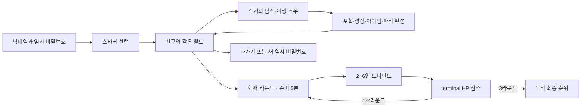
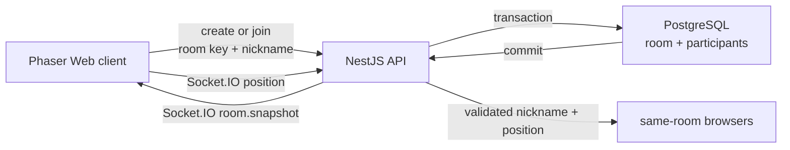

# Poke Lounge Game Concept

확인 기준일: 2026-08-19
구현 기준: `main`

이 문서는 Poke Lounge의 플레이 경험, 게임 규칙, 멀티플레이 구조와 현재 제품 경계를 한곳에 정리한 기준 문서다. 사용자에게 보이는 게임 컨셉을 먼저 설명하고, 그 컨셉을 지탱하는 서버 권위·저장·검증 구조를 뒤에서 연결한다.

제품 규칙은 [Poke Lounge 게임 규칙 인덱스](./poke-lounge-rules/index.md)에서 시작한다. 이
문서는 현재 구현된 플레이 경험의 개요이며, 공개 멀티플레이의 3라운드 누적 점수 챔피언십은
[3라운드 챔피언십 규칙](./poke-lounge-rules/three-round-championship.md)을 따른다.
챔피언십 라운드 점수는 토너먼트 순위 배점이 아니라 파티 포켓몬의 남은 체력 비율 합계다.

Poke Lounge는 비공식 Pokémon 팬 게임이다. 기술 구현이 완료됐거나 배포 빌드가 통과했다는 사실은 Pokémon 관련 명칭·표장·데이터·에셋의 공개 사용 권리를 의미하지 않는다. 현재 공개 출시 권리 상태는 [Poke Lounge Release Gate](./poke-lounge-release-gate.md) 기준 `UNRESOLVED`다.

## 한 문장 컨셉

닉네임과 친구끼리 공유한 임시 비밀번호만 입력하면 같은 월드에서 탐색·포획·육성을 즐기고,
5분 준비와 3라운드 토너먼트로 최종 우승을 겨루는 브라우저형 포켓몬 팬 게임이다.

## 멀티플레이 제품 계약

멀티플레이의 공개 진입 계약은 다음 두 단계뿐이다.

1. 사용자가 닉네임과 임시 비밀번호를 입력한다.
2. 같은 임시 비밀번호를 입력한 사용자끼리 자동으로 같은 세션에 연결되어 서로의 닉네임과 움직임을 보며 게임을 즐긴다.
3. 참가자 2명 이상의 파티 동기화가 끝나면 1라운드 5분 준비가 자동 시작되고, 총 3회의
   싱글 엘리미네이션 토너먼트와 terminal HP 누적 점수로 최종 순위를 정한다.

첫 사용자는 세션을 자동 생성하고 다음 사용자는 자동 참가한다. 참가자의 닉네임과 월드 위치는 Socket.IO로 같은 세션에 실시간 전달한다. 포획·파티·재화와 솔로 전투 진행은 각 사용자의 탭에 독립적으로 저장한다.

한 세션에는 최대 6명이 참가한다. 7번째 신규 사용자는 관전자로 전환하지 않고 접속을
거부한다. 동일 사용자는 브라우저 탭의 `playerId + sessionId` 조합으로 판별하므로 같은 탭의
새로고침과 15초 안의 연결 복구는 기존 자리를 유지한다. 다른 탭·브라우저·기기는 같은
닉네임과 임시 비밀번호를 입력해도 신규 사용자이며, 명시적으로 나간 뒤 다시 들어와도 새
사용자로 참가한다.

사용자에게 방 코드, 생성·참가 구분, 초대 링크, 준비 시간 선택, Google 로그인이나 경쟁전
설정을 요구하지 않는다. 공개 클라이언트는 현재 파티와 ready를 자동 동기화하고, 로그인 계정용
competitive seat 대신 비공개 `sessionId`로 자기 대진의 행동만 제출한다. 임시 비밀번호는
NFKC 정규화 후 브라우저에서 SHA-256 기반 6자리 세션 키로 파생하며 원문은 URL, 브라우저
저장소, API 요청에 남기지 않는다. 세션이 끝난 뒤에는 새 임시 비밀번호를 사용한다.

직접 `network=local`, `network=server`, `room`, `roundMs`를 넣는 URL과 경쟁 좌석 API는 회귀·통합 테스트를 위한 내부 호환 경로다. 공개 제품 기능이나 사용자 안내 대상으로 취급하지 않는다.

## 제품 정체성

Poke Lounge는 장편 RPG나 MMO보다 짧은 세션의 **탐색·육성·대전 루프**에 집중한다. 멀티플레이 입장보다 실제 플레이에 집중할 수 있도록 접속 절차를 최소화한다.

| 설계 축            | 의도                                                                      |
| ------------------ | ------------------------------------------------------------------------- |
| 브라우저 접근성    | 설치 없이 데스크톱 키보드와 모바일 터치로 바로 시작한다.                  |
| 함께하는 월드      | 같은 세션의 닉네임과 움직임을 실시간으로 공유한다.                        |
| 익숙한 전투 감각   | Gen 4풍 턴제 전투, 타입 상성, PP, 상태 이상, 포획과 성장 경험을 제공한다. |
| 소규모 소셜 플레이 | 친구 2~6명이 같은 임시 비밀번호로 참가해 같은 월드에서 움직인다.          |
| 단순한 입장        | 계정, 방 코드, 초대 링크나 별도 경쟁 설정 없이 바로 접속한다.             |

주요 대상은 다음과 같다.

- 혼자 짧게 탐색·포획·육성을 즐기려는 사용자
- 2~6명이 임시 비밀번호 하나만 공유해 함께 즐기려는 친구 그룹
- 데스크톱과 모바일 브라우저에서 같은 게임 흐름을 경험하려는 사용자
- Web, API, PostgreSQL과 실시간 동기화가 결합된 게임 구조를 확인하려는 VSCoke 방문자

## 핵심 플레이 루프


```mermaid
flowchart LR
  Entry["닉네임과 임시 비밀번호"] --> Starter["스타터 선택"]
  Starter --> World["친구와 같은 월드"]
  World --> Encounter["각자의 탐색·야생 조우"]
  Encounter --> Growth["포획·성장·아이템·파티 편성"]
  Growth --> World
  World --> Prep["현재 라운드 · 준비 5분"]
  Prep --> Tournament["2~6인 토너먼트"]
  Tournament --> Score["terminal HP 점수"]
  Score -->|"1·2라운드"| Prep
  Score -->|"3라운드"| Result["누적 최종 순위"]
  World --> Exit["나가기 또는 새 임시 비밀번호"]
```

1. 사용자는 혼자 시작하거나 닉네임과 임시 비밀번호로 멀티플레이에 접속한다.
2. 저장된 파티가 없다면 치코리타, 브케인, 리아코 중 Lv.10 스타터 한 마리를 고른다.
3. 마을을 이동하며 야생 포켓몬과 싸우고, 포획하고, 경험치와 돈을 얻는다.
4. 간호사, 상점, PC 박스와 주사위 게임을 이용해 파티와 자원을 정비하고 각자의 챌린지와 전투를 이어 간다.
5. 두 명 이상이 모이면 화면의 현재 라운드와 남은 시간을 보며 파티를 정비한다.
6. 준비 종료 때 동결한 파티로 토너먼트를 진행하고, 3라운드 누적 점수로 최종 순위를 정한다.
7. 세션을 나가면 닉네임·임시 비밀번호 화면으로 돌아간다.

솔로는 토너먼트 타이머를 시작하지 않는다. 공개 멀티플레이는 월드 탐색·야생전·성장 루프를
5분 준비 중에도 계속 제공하고, 준비 종료 시점의 최신 유효 파티를 동결한다. 월드의 솔로
챌린저에게 말을 걸면 현재 파티를 그대로 복제한 동급 미러전으로 세션을 마칠 수 있다.

## 게임 모드

| 공개 모드       |  참가 | 입장 방식                   | 상태                                      |
| --------------- | ----: | --------------------------- | ----------------------------------------- |
| 솔로            |   1명 | 이어하기 또는 새 게임       | 브라우저 로컬 상태                        |
| 멀티플레이 세션 | 2~6명 | 닉네임 + 같은 임시 비밀번호 | shared world + 서버 권위 3라운드 챔피언십 |

멀티플레이 세션은 shared world의 접속 단위이자 3라운드 챔피언십 진행 단위다. 두 명 이상의
파티 동기화가 끝나면 `round-started`로 전환하고 정확히 5분 뒤 대진을 만든다. 준비 중 이탈로
2명 미만이 되면 ghost 참가자나 기권 대진을 만들지 않고 `waiting`으로 돌아간다. 연결된
참가자가 모두 사라지면 방은 만료 정책에 따라 정리된다.

## 월드와 탐색

현재 월드는 단일 `town` 맵이다. 플레이어는 픽셀 아트 마을에서 충돌 타일, 조우 지역과 NPC 상호작용 지점을 탐색한다. 공개 멀티플레이는 인증된 세션 참가자의 닉네임·좌표·방향만 같은 방의 다른 참가자에게 중계하고, 클라이언트가 보낸 player/session identity와 파티 데이터는 중계하지 않는다.

주요 상호작용은 다음과 같다.

- 간호사: 현재 파티 전체의 HP, PP와 상태를 무료 회복
- 일반 상점: 기본 회복·포획 아이템 판매
- 희귀 상점: 진화·고급 회복·포획 아이템 판매
- 보관 PC: 파티와 박스 사이 포켓몬 이동·교환
- 게임 진행자: ₽100을 거는 주사위 예측 게임
- 솔로 챌린저: 현재 성장 파티와 동일한 구성의 미러 트레이너전
- 야생 지역: 이동이 완료된 타일 단위로 지역별 조우 판정

야생 조우 기본 확률은 완료된 타일 이동 한 번당 15%다. 각 지역은 10종의 기본 풀을 중심으로 출현하고, 같은 지역의 나머지 전국도감 범위는 합산 가중치 2의 희귀 풀로 출현한다. 희귀 풀의 모든 종은 양수 가중치를 가져 전국도감 1번부터 493번까지 항상 포획할 수 있다. 야생 레벨은 현재 파티 평균 레벨보다 최대 5 낮은 범위부터 평균 레벨까지에서 보정된다.

| 지역      | 전국도감 범위 | 기본 풀 | 희귀 풀 | 세대 범위 |
| --------- | ------------- | ------: | ------: | --------- |
| 서쪽 필드 | 1–151         |    10종 |   141종 | 1세대     |
| 광장 필드 | 152–251       |    10종 |    90종 | 2세대     |
| 남쪽 필드 | 252–493       |    10종 |   232종 | 3–4세대   |

지역을 판별할 수 없는 `town` 조우는 1–493 전체를 fallback 범위로 사용한다. 알·불량알과 별도 폼용 내부 레코드는 실제 종 목록에 포함하지 않는다.

## 파티, 성장과 경제

파티는 최대 6마리다. 파티가 가득 찬 상태에서 포획한 포켓몬은 PC 박스로 이동하며, 사용자는 필드 PC에서 파티와 박스를 관리할 수 있다. 마지막 파티 포켓몬을 박스로 보내거나 쓰러진 포켓몬을 선두로 지정하는 동작은 제한된다.

야생전에서 이기거나 포획하면 다음 진행이 발생한다.

- 경험치 획득과 최대 Lv.100까지 레벨 상승
- 레벨에 따른 능력치 재계산
- 레벨업 기술 학습과 최대 4개 기술 교체 선택
- 지원되는 레벨 진화 규칙과 진화 연출
- 상대의 기본 경험치와 레벨에 비례한 포켓달러 획득
- 포획 시 쓰러뜨린 경우의 절반 수준 포켓달러 보상

상점은 랭크와 무관하게 모든 품목을 판매하며 구매 가능 여부는 보유 금액으로 결정한다.

| 상점 | 아이템     |   가격 |
| ---- | ---------- | -----: |
| 일반 | 포션       |   ₽300 |
| 일반 | 몬스터볼   |   ₽200 |
| 일반 | 해독제     |   ₽100 |
| 일반 | 좋은상처약 |   ₽700 |
| 희귀 | 고급상처약 | ₽1,500 |
| 희귀 | 기력의조각 | ₽3,000 |
| 희귀 | 하이퍼볼   | ₽2,500 |
| 희귀 | 이상한사탕 | ₽8,000 |

주사위 게임은 기준 숫자보다 결과가 낮을지, 같을지, 높을지를 예측한다. 경우의 수가 적은 선택일수록 성공 보상이 커지는 확률 비례 배당을 사용한다.

## 전투 모델

Poke Lounge에는 목적이 다른 두 전투 규칙이 공존한다.

| 구분 | 야생·캐주얼 전투                | 서버 권위 경쟁전                           |
| ---- | ------------------------------- | ------------------------------------------ |
| 파티 | 사용자가 포획·육성한 최대 6마리 | 준비 종료 때 동결한 실제 육성 파티 1~6마리 |
| 명령 | 싸운다·가방·포켓몬·도망         | 기술 사용·교체                             |
| 계산 | Gen 4풍 브라우저 규칙           | V2 규칙·카탈로그 hash의 결정론 엔진        |
| 난수 | 브라우저 전투 흐름              | 서버 seed와 turn 기반 PRNG                 |
| 결과 | 클라이언트 상태에 반영          | 서버가 HP·상태·승패·점수 확정              |
| 랭킹 | 공개 랭킹 근거 아님             | client-authored 파티이므로 공개 랭킹 제외  |

### 야생·캐주얼 전투

기본 명령은 `싸운다 / 가방 / 포켓몬 / 도망`이다. 기술은 최대 4개와 PP를 가지며, 물리·특수·상태 분류를 사용한다.

전투 계산에는 다음 요소가 포함된다.

- 스피드 기반 행동 순서
- 명중·회피 단계와 급소
- STAB와 Gen 4 타입 상성
- 85~100% 대미지 난수
- 공격·방어·스피드·명중률 단계 변화
- 독·화상·마비·전투불능 상태와 턴 종료 피해
- 포켓몬 교체, 회복·상태·부활 아이템
- 야생 포켓몬 포획과 도주 판정

포획은 상대 HP, 종족 포획률과 볼 배율을 반영하는 Gen 4식 네 번의 흔들림 판정을 사용한다. 트레이너전에서는 포획과 도주가 제한된다. 포획·도주 실패 또는 아이템 사용은 상대 행동 기회를 소비한다.

### 챔피언십 서버 권위 경쟁전

이 절과 다음 토너먼트 절은 공개 멀티플레이 챔피언십의 서버 권위 계약이다.

서버 권위전은 준비 종료 때 동결한 각 플레이어의 실제 육성 파티로 시작한다. 클라이언트는 종·레벨·슬롯·IV·기술 ID·현재 HP·상태·PP만 제출하며, 서버가 생성된 1~493 종과 1~470 기술 카탈로그로 파생 수치와 상한을 검증한다. 잘못된 파티나 전투불능 선두는 다른 파티로 대체하지 않고 명시적으로 거절한다.

물리·특수 공격은 Gen 4 대미지, STAB, 타입 상성, 명중, 급소와 85~100% 난수를 적용한다. 지원하는 상태·능력 단계 효과는 적용하고, 지원하지 않는 부가 효과가 붙은 공격은 기본 대미지만 적용한다. 지원하지 않는 순수 상태 기술은 ID와 PP를 보존하되 선택할 수 없다.

활성 포켓몬의 모든 기술 PP가 0이면 예약 행동 `struggle`만 사용할 수 있다. `struggle`은 위력 50, 명중률 100%이며 사용자 최대 HP의 1/4을 반동으로 소비한다.

로그인 사용자는 계정에 바인딩된 player, 비로그인 공개 세션은 방 코드와 비공개 session
identity로 결정된 player의 현재 turn 행동만 제출할 수 있다. 서버는 다음 순서와 난수 소비
순서를 고정한다.

한쪽 행동이 먼저 제출된 뒤 60초 안에 상대 행동이 없으면 먼저 제출한 플레이어의 timeout 승리로 확정한다. 기준 시각은 서버 DB에 저장된 첫 행동 receipt의 생성 시각이다.

1. 교체 행동 적용
2. 스피드와 동률 판정
3. 마비 행동 불가 판정
4. 명중, 급소, 대미지 범위와 부가 효과 판정
5. HP·PP·상태·교체 필요 상태와 terminal 판정

포켓몬이 쓰러지면 서버가 자동 교체하지 않는다. 해당 플레이어가 다음 turn에 유효한 포켓몬으로 `switch` 행동을 직접 제출해야 한다.

클라이언트는 승자, 패자, 점수나 terminal을 권위 입력으로 제출하지 않는다. 서버가 terminal의
승패·종료 사유·양쪽 frozen party HP를 확정한다. 챔피언십 라운드 점수는 승자 100점·패자
50점이 아니라 각 파티원의 `현재 HP / 최대 HP × 100` 합계다.

한 토너먼트의 다음 매치는 같은 frozen party에서 새로 시작한다. 서버 권위 PvP 중 발생한 HP·PP·상태·선두 변경은 다음 매치나 월드 저장 파티에 누적하지 않는다.

## 챔피언십 토너먼트와 점수

토너먼트는 2~6인 싱글 엘리미네이션이다. 서버가 참가 순서와 player ID를 기준으로 seed를 확정하고 canonical bracket과 부전승을 생성한다. Web은 서버 bracket을 표시할 뿐 참가자 배열로 대진을 다시 계산하지 않는다.

5인 첫 대진은 다음과 같다.

```text
seed 4 ─┐
        ├─ 첫 active match의 승자 ─┐
seed 5 ─┘                           ├─ 다음 단계
seed 1 ─────────────── bye ─────────┘

seed 3 ─────────────── bye ─┐
                            ├─ 다음 단계
seed 2 ─────────────── bye ─┘
```

여러 ready match를 동시에 열지 않고 서버가 한 경기씩 순차 활성화한다. 5인 경기에서 seed 5가 첫 매치를 이기면 다음 ready match는 `seed 1 vs seed 5`, 이어서 `seed 3 vs seed 2` 순서다. 한 방에는 최대 6명만 참가할 수 있으며 7번째 신규 사용자의 접속은 거부한다. 기존 참가자의 동일 세션 재접속은 정원과 관계없이 허용하고, 참가자가 방에서 나가 자리가 비면 새 사용자의 입장을 허용한다.

각 라운드 점수는 토너먼트 최종 순위와 무관하게 서버가 보관한 terminal frozen party의 남은
체력 비율을 합산한다. 1·2라운드 뒤에는 누적 중간 순위를 표시하고 다음 5분 준비로 이동한다.
3라운드 뒤에는 누적 점수 내림차순으로 최종 순위를 만들며 같은 점수에는 같은 순위를
부여한다.

방 내부 누적 점수와 공개 Poke Lounge 랭킹 점수는 서로 다른 개념이다.

| 결과 경로                   | 신뢰 분류            | 저장·공유           | 공개 Poke Lounge 랭킹 |
| --------------------------- | -------------------- | ------------------- | --------------------- |
| 일반 결과 API               | `client-asserted`    | API 제출 가능       | 제외                  |
| 로컬·WebRTC 결과            | client/host asserted | 일반 결과 제출 가능 | 제외                  |
| 서버 방 casual `/result`    | unranked             | room 전진           | 제외                  |
| 2~6인 `tournament-unranked` | 서버 권위            | bracket 전진        | 제외                  |

공개 닉네임·임시 비밀번호 경로는 항상 `tournament-unranked` 서버 권위 대진을 사용한다. 나머지
결과 경로는 솔로·direct URL 회귀를 위한 내부 호환이며 공개 챔피언십 판정에 사용하지 않는다.
| 과거 `ranked-head-to-head` | `verified-room` | 감사용 완료 이력 | 기존 기록만 포함 |

공개 랭킹은 `verified-room` 결과만 먼저 필터링한 뒤 사용자별 최고 점수로 계산한다. 현재 V2 육성 파티는 획득 이력을 서버가 증명하지 못하므로 정확히 2명이어도 `tournament-unranked`이며 새 공개 랭킹 이력을 만들지 않는다.

일반 결과 API 정책과 실제 솔로 플레이 흐름은 구분해야 한다. 솔로 챌린지를 완료하면 승리 100점, 패배 0점의 `game-result`로 전환되어 일반 결과를 제출할 수 있다. 이 점수는 로컬 경쟁 통계와 공개 검증 랭킹에는 반영하지 않는다.

## 멀티플레이 구현과 상태 수렴

세션 참가 상태의 원본은 PostgreSQL이다. REST는 자동 생성·참가와 장애 복구를 담당한다. Socket.IO subscription은 room의 session/player identity로 승인하며, 승인된 소켓만 월드 위치 event를 같은 room의 다른 참가자에게 보낼 수 있다. 서버는 event의 identity와 닉네임을 durable participant 값으로 덮어쓰고 좌표·방향만 전달한다.


```mermaid
flowchart LR
  Web["Phaser Web client"] -->|"create or join\nroom key + nickname"| API["NestJS API"]
  API -->|"transaction"| DB["PostgreSQL\nroom + participants"]
  DB -->|"commit"| API
  API -->|"Socket.IO room.snapshot"| Web
  Web -->|"Socket.IO position"| API
  API -->|"validated nickname + position"| Peer["same-room browsers"]
```

공개 shared world는 자동 party snapshot과 ready가 2명 이상 모이면 5분 준비와 토너먼트로
전환한다. 아래 revision, match, terminal 수렴은 공개 챔피언십과 내부 direct room 경로에 함께
적용한다.

모든 일반 room mutation은 UUID v4 `X-Idempotency-Key`와 `If-Match-Revision`을 요구한다. 같은 key와 같은 요청은 저장된 응답을 재생하고, 같은 key에 다른 요청이나 오래된 revision은 충돌로 처리한다.

한 매치가 끝나는 transaction은 terminal metadata, bracket 전진, 다음 assignment와 적용 가능한 action·room-command receipt를 함께 확정한다. 공개 snapshot은 두 역할을 분리한다.

- `competitiveTransitions`: 완료된 이전 매치의 terminal transition 목록. 복구 시 cursor 이후 최대 8개
- optional `competitive`: 현재 진행해야 할 다음 assignment

Web은 이전 terminal을 먼저 적용해 양쪽 플레이어가 승리·패배 결과를 보게 한 뒤 현재 assignment를 적용한다. event ID와 match ID로 중복을 제거하고, 같은 페이지 reconnect에서는 마지막으로 안전하게 적용한 terminal revision 이후를 `afterRevision`으로 복구한다. 결과를 확인한 참가자는 월드로 돌아오며, 현재 다음 assignment에 포함된 참가자만 새 BattleScene을 정확히 한 번 시작한다. 그 외 참가자는 월드에서 다음 배정을 기다린다.

이 구조는 5명이 동시에 하나의 전투를 하는 모델이 아니다. 최대 6인 canonical bracket 안에서 정확히 두 명의 서버 권위 match를 순차 실행하는 모델이다.

## 저장과 복구

| 상태          | 저장 위치                  | 범위                                                      |
| ------------- | -------------------------- | --------------------------------------------------------- |
| 익명 플레이어 | versioned `sessionStorage` | 현재 탭의 파티·박스·재화·위치·단축키 안내 확인 상태       |
| 서버 방       | PostgreSQL                 | room aggregate, revision, TTL, command receipt            |
| 경쟁 매치     | PostgreSQL                 | canonical battle state, action receipt, terminal metadata |

멀티플레이 접속에는 계정 인증이 필요하지 않다. 익명 플레이 상태는 탭 단위로 저장하고
멀티플레이 room, frozen party, 대진과 competitive battle state는 서버에서 동기화한다. 기존
계정 저장 코드는 다른 게임과 선택적 로그인 저장을 위해 남아 있지만 멀티플레이 진입 계약이
아니다.

자동 저장은 상태 변경 후 debounce, 주기 저장과 정상 종료 final flush를 조합한다. 인증 GET이 실패하면 로컬 상태로 게임은 열지만, 서버 상태를 오래된 로컬 값으로 덮어쓰지 않도록 복구 전까지 원격 autosave를 시작하지 않는다.

## 화면, 입력과 오디오

게임 캔버스는 4:3 비율을 유지하며 기본 512×384, 선택적 768×576 표시 크기를 사용한다. 전투 화면은 256×192 논리 좌표를 확대해 픽셀 아트와 ROM풍 전투 창을 표현한다.

데스크톱 기본 조작:

- 이동: `WASD` 또는 방향키
- 확인·대화: `Enter`, `Space`, `Z`
- 가방: `I`
- 도움말: `H`
- 뒤로: `Esc`, `Backspace`

모바일은 방향 패드와 `A`, `B`, `I`, `?` 터치 버튼을 제공한다. iPhone WebKit처럼 `maxTouchPoints = 0`으로 보고되는 환경도 mobile user agent와 coarse pointer를 함께 사용해 터치 UI를 판단한다.

주요 연출은 전투 전환, HP 감소 tween, 피격 흔들림·점멸, 쓰러짐과 진화 연출이다. 필드와 야생전 BGM, 확인·취소·전투 시작·피격·쓰러짐 효과음은 첫 사용자 입력 후 활성화되며, 현재 런타임 오디오는 로컬 HeartGold ROM의 SDAT에서 렌더링한 자산이다. 배포 권리 상태는 별도 provenance 문서에서 추적한다.

## 기술 구조

```text
apps/web
  Next.js route와 React wrapper
  Phaser BootScene / WorldScene / BattleScene
  local save, room adapter, UI와 입력

apps/api
  account save와 game history
  durable Poke Lounge room과 live position gateway
  공개 session action + 선택적 account competitive seat

packages/poke-lounge-battle
  솔로 전투 규칙
  canonical state, PRNG와 bracket

PostgreSQL
  room aggregate와 participant
  competitive match/action와 verified history
```

공개 멀티플레이는 room 참가 상태, live position gateway와 서버 권위 competitive action을
사용한다. Web과 API는 `@vscoke/poke-lounge-battle` 규칙을 공유한다. API DTO에서 생성한
local OpenAPI JSON과 Web generated type이 두 앱 사이의 계약 기준이다.

현재 Socket event publisher에는 multi-instance fan-out adapter가 없다. PostgreSQL은 durable source지만 실시간 전파는 단일 API 인스턴스를 전제로 한다.

## 검증 전략과 현재 증거

검증 계층은 다음과 같다.

- 공통 엔진 unit: bracket, bye, scoring, canonical state, PRNG와 turn resolver
- Web unit: 저장 snapshot, 터치 감지, terminal cache, scene launch와 game state
- API unit·integration: room policy, idempotency, projection과 경쟁 service
- PostgreSQL E2E: migration, transaction rollback, receipt replay와 verified history
- Playwright: 스타터, 월드, 전투, 저장, 멀티플레이와 모바일 입력

기존 경쟁 release gate는 실제 Nest API, PostgreSQL과 Socket.IO를 사용해 다음 context를 동시에 열었다.

| 테스터 | 환경                                | 입력·특징                         |
| -----: | ----------------------------------- | --------------------------------- |
|      1 | Desktop Chromium                    | keyboard, host, seed 1 bye        |
|      2 | Desktop Firefox                     | keyboard, cold reload, seed 2 bye |
|      3 | Desktop WebKit                      | keyboard, seed 3 bye              |
|      4 | Mobile Chromium / Pixel 7 emulation | touch, seed 4 첫 매치             |
|      5 | Mobile WebKit / iPhone 13 emulation | touch, seed 5 첫 매치             |

targeted 1회와 fresh release 3회가 모두 5/5 통과했다. 다섯 context는 테스트 전용 bootstrap의 서로 다른 `e2e-user-1`~`e2e-user-5` identity를 사용하며 실제 Google 계정이 아니다. 모바일 두 환경도 물리 기기가 아니라 Playwright device emulation이다. 이 결과는 서버 권위 대진 수렴 검증이며 닉네임·임시 비밀번호를 실제 입력하는 공개 멀티브라우저 acceptance를 대신하지 않는다.

이 검증은 **5인 전체 토너먼트를 champion 확정까지 완주한 E2E가 아니다.** 첫 매치 종료부터 다음 assignment까지의 가장 위험한 수렴 경계를 검증한 release gate다. 실제 5브라우저 통합 실행은 격리 PostgreSQL이 필요한 로컬 gate이며 PR CI는 focused Chromium 회귀와 통합 spec 수집 조건을 담당한다.

## 현재 완료 범위

- 솔로 월드 탐색, 야생전, 포획, 성장, 상점, 인벤토리와 PC 박스
- 데스크톱 키보드와 모바일 터치 입력
- 닉네임·임시 비밀번호 기반 멀티플레이 자동 생성·참가
- 임시 비밀번호 원문 비저장·비전송
- 같은 세션 참가자의 닉네임·월드 위치 실시간 중계
- 공개 경로의 party snapshot·ready 자동 동기화와 5분 남은 시간 표시
- 비로그인 session identity 기반 서버 권위 대진
- 3라운드 terminal HP 누적 점수와 공동 순위
- PostgreSQL durable room과 REST·Socket.IO 복구
- bracket·서버 권위 match 회귀 테스트

## 현재 제약과 비목표

- 월드는 단일 마을이며 장거리 탐험, 퀘스트와 스토리 캠페인은 없다.
- 멀티플레이의 파티·재화 진행은 공유하지 않으며 준비 종료 시점의 경쟁용 파티 복사본만 서버에 동결한다.
- 임시 비밀번호는 계정 비밀번호가 아니라 짧은 세션을 찾는 공유 secret이다.
- Google 로그인, 계정 선택, 방 코드, 초대 링크, 로비, 친구 목록, matchmaking과 시즌 시스템은 멀티플레이 제품 범위가 아니다.
- 여러 API 인스턴스 사이의 Socket fan-out은 지원하지 않는다.
- 수동 WebRTC는 개발·실험 경로이며 운영 멀티플레이로 취급하지 않는다.
- 인게임 문구는 대부분 한국어 중심이며 전체 다국어 게임 UI는 완료되지 않았다.
- 물리 iOS Safari와 실제 네트워크 품질에서의 장시간 human game-feel 검증은 별도다.
- 5인 전체 bracket 완주 E2E는 아직 없다.

## 공개 출시 조건

기술 상태와 권리 상태는 별도다. 현재 오디오 관련 provenance는 승인됐지만 Pokémon 이름·표장·게임 데이터, ROM-derived data, 스프라이트, 텍스처, character atlas, map material과 ported code의 배포 권리는 해결되지 않았다.

`pnpm check:poke-lounge-provenance`는 미해결 항목 때문에 의도적으로 실패한다. 기본 Vercel build가 이 상태를 자동 차단하지 않는 것은 권리 승인이 아니다. 공개 출시 전에는 다음이 필요하다.

1. 미해결 에셋의 교체·제거 또는 서면 권리 근거 확보
2. provenance manifest의 hash·source·attribution·reviewer 기록 완성
3. release owner 지정과 서명된 최종 결정
4. 필요한 법률·상표 검토

## 향후 확장 우선순위

멀티플레이 접속 기능은 의도적으로 확장하지 않는다. 닉네임과 임시 비밀번호만으로 접속해 즐긴다는 계약을 유지한다.

1. 에셋과 코드의 권리 문제를 먼저 해결해 공개 출시 기준을 확정한다.
2. 닉네임·임시 비밀번호 정상/실패 경로와 실제 2인 접속 E2E를 운영한다.
3. 권리 정리된 신규 맵, NPC, 퀘스트와 콘텐츠 데이터를 추가한다.

## Source of truth

| 주제                    | 기준 문서·코드                                                                                                    |
| ----------------------- | ----------------------------------------------------------------------------------------------------------------- |
| 제품 게임 규칙          | [Poke Lounge 게임 규칙 인덱스](./poke-lounge-rules/index.md)                                                      |
| 전체 모노레포 구조      | [VSCoke Monorepo Concept](./vscoke-monorepo-concept.md)                                                           |
| 공개 멀티플레이 검증    | [Poke Lounge 공개 멀티플레이 테스트 시나리오](./poke-lounge-multiplayer-test-scenarios.md)                        |
| 저장·룸·경쟁 구현       | `apps/api/src/poke-lounge/`, `apps/web/src/components/poke-lounge/runtime/game/`                                  |
| terminal 수렴 완료 상태 | [Terminal Client Convergence Plan](./superpowers/plans/2026-07-16-poke-lounge-terminal-client-convergence-fix.md) |
| 점수와 공개 랭킹        | [Game Score Policy](./game-score-policy.md)                                                                       |
| 공개 출시 권리          | [Poke Lounge Release Gate](./poke-lounge-release-gate.md)                                                         |
| 에셋 인벤토리           | [Poke Lounge Asset Provenance](./poke-lounge-asset-provenance.md)                                                 |
| 월드·전투 runtime       | `apps/web/src/components/poke-lounge/runtime/game/`                                                               |
| 서버 room과 경쟁전      | `apps/api/src/poke-lounge/`                                                                                       |
| 공통 전투·대진 규칙     | `packages/poke-lounge-battle/`                                                                                    |
| 5환경 검증              | `apps/web/tests/e2e/poke-lounge-five-player-tournament.spec.ts`                                                   |

제품 목표는 게임 규칙 인덱스와 연결 문서를 우선한다. 현재 구현 여부는 실행 코드, migration과
테스트를 우선한다. 확정 규칙과 현재 구현이 다르면 규칙을 삭제하거나 코드가 이미 구현됐다고
간주하지 않고 구현 공백으로 관리한다. 과거 port·roadmap·implementation plan은 결정 배경과
구현 이력으로만 사용한다.
