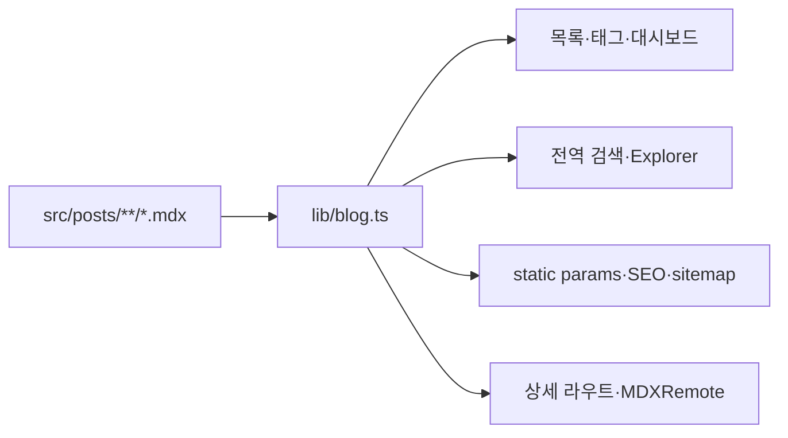
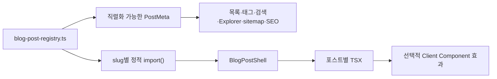

# 블로그 포스트 MDX 제거 구현 계획

**Goal:** 기존 41개 블로그 URL와 메타데이터 계약을 유지하면서 블로그 본문을 MDX 문자열
렌더링에서 포스트별 TSX 모듈로 전환해, 각 글이 독립적인 레이아웃·상태·모션·인터랙션을
구현할 수 있게 한다.

**Architecture:** 타입이 보장된 중앙 레지스트리가 포스트 메타데이터와 정적
`import()` 로더를 함께 관리한다. 목록·태그·검색·Explorer·sitemap·SEO는 레지스트리의
직렬화 가능한 메타데이터만 사용하고, 상세 라우트는 요청한 slug의 TSX 모듈만 지연
로딩한다. 공통 헤더와 공유 UI는 `BlogPostShell`에 유지하되 본문 TSX에는 레이아웃 제약을
강제하지 않는다. 전환 중에는 TSX 레지스트리를 우선하고 아직 변환하지 않은 글만 기존
MDX 경로로 읽는 임시 호환 계층을 사용하며, 마지막 단계에서 반드시 제거한다.

**Tech Stack:** Next.js 15 App Router, React 19 Server Components, TypeScript, Tailwind CSS 4,
next-intl, Playwright.

---

## 범위와 결정

### 포함

- `apps/web/src/posts` 아래 블로그 포스트 41개를 `.mdx`에서 `.tsx`로 전환
- 포스트별 React 컴포넌트, Client Component island, CSS·Canvas 기반 효과 허용
- 기존 slug, 정렬, 공개 여부, 제목, 설명, 태그, 카테고리, 읽기 시간 보존
- 블로그 목록·대시보드·전역 검색·Explorer·sitemap·OpenGraph·JSON-LD 동작 보존
- 공통 본문 요소와 포스트별 자유 레이아웃을 함께 지원

### 제외

- `apps/web/resume-detail`의 MDX 8개 전환
- 기존 포스트 내용의 교정·번역·재디자인
- 외부 이미지 105개의 로컬 다운로드 또는 라이선스 재검토
- 모든 포스트에 신규 애니메이션을 일괄 추가하는 작업

블로그만 전환해도 이력서 상세가 MDX를 계속 사용하므로 `next-mdx-remote`,
`gray-matter`, `@types/mdx`는 이 브랜치에서 제거하지 않는다. 블로그 전용
`reading-time`만 사용처가 사라지면 제거한다. 저장소 전체에서 MDX 의존성을 없애려면
이력서 상세 전환을 별도 계획으로 진행한다.

원시 HTML 문자열과 `dangerouslySetInnerHTML`은 포스트 본문 렌더링에 사용하지 않는다.
표현 자유도는 HTML 주입이 아니라 TSX와 선택적인 Client Component로 확보한다.

---

## 현재 상태 기준선

2026-07-26 기준 ignored-aware `fd`와 `rg`로 확인한 결과:

- 블로그 MDX: 41개
- 이력서 상세 MDX: 8개
- 블로그의 코드 fence 포함 포스트: 27개
- Markdown 표 포함 포스트: 11개
- Markdown 이미지: 106개
  - `blog.kakaocdn.net`: 105개
  - 로컬 `/images/blog/og-fail.png`: 1개
- 코드 fence 밖 MDX 전용 import/export 또는 커스텀 컴포넌트 사용: 0개
- 현재 41개 포스트는 모두 `published: true`

현재 연결 관계:



목표 연결 관계:



---

## 목표 파일 구조

```text
apps/web/src/
├─ components/blog/
│  ├─ blog-post-elements.tsx
│  ├─ blog-post-shell.tsx
│  ├─ pre-block.tsx
│  └─ ...
├─ posts/
│  ├─ blog-post-registry.ts
│  ├─ blog-post-registry.spec.ts
│  ├─ dev/
│  │  ├─ centos8-mysql-delete.tsx
│  │  └─ ...
│  └─ journal/
│     ├─ hello-world.tsx
│     └─ ...
├─ lib/blog.ts
└─ types/blog.ts
```

- 일반 글은 `<slug>.tsx` 한 파일로 유지한다.
- 독립적인 상태·모션이 필요한 글만 `<slug>-effect.tsx` 같은 Client Component를
  같은 디렉터리에 추가한다.
- 포스트 모듈은 Server Component가 기본이며 브라우저 API, 상태, 이벤트가 필요한 가장
  작은 하위 컴포넌트에만 `"use client"`를 둔다.
- 공통 요소는 선택 사항이다. 특수 레이아웃 포스트는 `blog-post-elements.tsx`를 사용하지
  않고 자체 마크업을 렌더링할 수 있다.

---

## 레지스트리 계약

레지스트리는 메타데이터와 로더의 단일 원본이다. slug와 메타데이터를 별도 manifest와
loader map에 중복 작성하지 않는다.

```ts
import type { ComponentType } from "react";

interface BlogPostModule {
  default: ComponentType;
}

export interface BlogPostDefinition extends PostMeta {
  load: () => Promise<BlogPostModule>;
}

export const blogPostDefinitions = [
  {
    slug: "journal/hello-world",
    category: "journal",
    title: "블로그를 시작하며",
    date: "2024-12-13",
    description: "MDX로 구현한 블로그의 첫 번째 포스트입니다.",
    tags: ["블로그", "Next.js", "MDX"],
    readingTime: "1 min read",
    published: true,
    load: () => import("@/posts/journal/hello-world"),
  },
] satisfies BlogPostDefinition[];
```

- `load`는 Next.js가 번들 경계를 분석할 수 있도록 반드시 문자열 리터럴
  `import()`를 사용한다.
- `getAllPosts()`는 `load`를 제외한 `PostMeta[]`만 반환해 Client Context에 함수가
  전달되지 않게 한다.
- `getBlogPostDefinition(slug)`는 상세 라우트에서만 사용한다.
- `readingTime`은 기존 화면값을 우선 보존한다. TSX AST에서 본문 단어 수를 추측하는
  런타임 로직은 추가하지 않는다.

---

## Task 1: 기존 동작을 회귀 테스트로 고정

**Files:**

- Create: `apps/web/src/lib/blog.spec.ts`
- Modify: `apps/web/tests/e2e/core-routes.spec.ts`
- Modify: `apps/web/tests/e2e/deep-link.spec.ts`

- [x] 현재 41개 slug와 핵심 메타데이터를 임시 기준선으로 추출한다.
- [x] slug 중복 없음, category와 slug prefix 일치, 필수 메타데이터 누락 없음,
      날짜 역순 정렬을 검증하는 단위 테스트를 추가한다.
- [x] `getAllTags()`와 `getPostsGroupedByCategory()` 결과가 전환 전후 동일하게 유지되는
      테스트를 추가한다.
- [x] 대표 상세 포스트에서 제목, 본문 문장, 표, 이미지, 코드 블록과 코드 복사 버튼을
      검증한다.
- [x] 잘못된 slug가 `notFound()`로 수렴하는 기존 동작을 고정한다.

Run:

```bash
pnpm test:web
pnpm --filter @vscoke/web e2e \
  tests/e2e/core-routes.spec.ts \
  tests/e2e/deep-link.spec.ts \
  --project=chromium
```

Commit boundary:

```text
test(blog):포스트 변환 회귀 추가
```

---

## Task 2: TSX 레지스트리와 임시 하이브리드 경로 추가

**Files:**

- Create: `apps/web/src/posts/blog-post-registry.ts`
- Create: `apps/web/src/posts/blog-post-registry.spec.ts`
- Create: `apps/web/src/components/blog/blog-post-elements.tsx`
- Create: `apps/web/src/components/blog/blog-post-shell.tsx`
- Modify: `apps/web/src/types/blog.ts`
- Modify: `apps/web/src/lib/blog.ts`
- Modify: `apps/web/src/app/[locale]/blog/[...slug]/page.tsx`

- [x] `BlogPostDefinition`과 loader 계약을 추가한다.
- [x] 레지스트리에서 slug 중복, loader 누락, 메타데이터 누락을 검증한다.
- [x] `getAllPosts()`가 변환된 TSX 포스트와 남은 MDX 포스트를 합치되 같은 slug가
      양쪽에 있으면 즉시 실패하게 한다.
- [x] 상세 라우트는 TSX 레지스트리를 먼저 조회하고, 미변환 포스트에만
      `MDXRemote` fallback을 사용한다.
- [x] 기존 상세 페이지의 뒤로가기, 공유, 태그, 날짜, 읽기 시간, JSON-LD를
      `BlogPostShell`로 이동한다.
- [x] heading, paragraph, list, link, quote, inline code, code block, table, image를
      표현하는 선택적 공통 요소를 만든다.
- [x] 외부 이미지의 원본 URL과 alt를 유지하는 `PostImage` 경계를 한 곳에 둔다.
      105개 원격 이미지의 크기를 알 수 없으므로 native ``가 필요하면 해당
      컴포넌트 한 줄에만 `@next/next/no-img-element` 예외와 한국어 이유를 남긴다.
- [x] 본문에서 원시 HTML 문자열이나 `dangerouslySetInnerHTML`을 허용하지 않는다.
      JSON-LD script의 기존 제한적 사용은 유지한다.

Run:

```bash
pnpm test:web
pnpm lint:web
pnpm type:check:web
```

Commit boundary:

```text
refactor(blog):TSX 포스트 기반 추가
```

---

## Task 3: 대표 포스트로 전환 경로 검증

**Files:**

- Create: `apps/web/src/posts/journal/hello-world.tsx`
- Modify: `apps/web/src/posts/blog-post-registry.ts`
- Delete: `apps/web/src/posts/journal/hello-world.mdx`
- Modify: `apps/web/tests/e2e/deep-link.spec.ts`

- [x] `journal/hello-world`의 frontmatter를 레지스트리로 옮긴다.
- [x] 본문을 읽기 쉬운 TSX로 변환하고 의미 구조와 코드 예시를 그대로 유지한다.
- [x] 기존 `/[locale]/blog/journal/hello-world` URL과 메타데이터가 변하지 않는지
      확인한다.
- [x] 포스트 모듈이 자체 wrapper, className, React 컴포넌트를 자유롭게 렌더링할 수
      있는지 확인한다.
- [x] 이 단계에서는 시각 효과를 억지로 추가하지 않는다. TSX 렌더 경계가 확보됐음을
      테스트하고 포스트별 디자인은 후속 작업으로 분리한다.
- [x] 대표 포스트 통과 후에만 해당 `.mdx`를 삭제한다.

Run:

```bash
pnpm test:web
pnpm --filter @vscoke/web e2e tests/e2e/deep-link.spec.ts --project=chromium
pnpm build:web
```

Commit boundary:

```text
refactor(blog):대표 포스트 TSX 전환
```

---

## Task 4: 나머지 40개 포스트를 위험도별로 전환

각 batch는 `레지스트리 추가 → TSX 본문 확인 → 테스트 → 대응 MDX 삭제` 순서를 지킨다.
모든 파일을 한 번에 이름만 바꾸지 않는다.

### Batch A: journal 포스트

- [x] `apps/web/src/posts/journal`의 나머지 8개 포스트 전환
- [x] 문단, 링크, 인용, 단순 코드 블록 위주 포스트부터 처리
- [x] journal 목록 정렬과 태그 집계 검증

### Batch B: 단순 dev 포스트

- [x] 이미지·표가 없는 dev 포스트 전환
- [x] 인라인 code와 외부 링크의 의미 구조 검증

### Batch C: 코드 중심 dev 포스트

- [x] 코드 fence가 있는 포스트를 `PreBlock` 기반 TSX로 전환
- [x] 언어 class와 복사 텍스트가 원문과 동일한지 검증
- [x] JSX 코드 예시는 실행 JSX가 아니라 코드 문자열로 남는지 확인

### Batch D: 표·이미지 중심 dev 포스트

- [x] Markdown 표 11개 포스트를 semantic table TSX로 전환
- [x] 이미지 106개의 URL, alt, 순서가 보존되는지 확인
- [x] `blog.kakaocdn.net` 링크가 접근 불가능한 경우 이미지를 조용히 삭제하거나
      임의 대체하지 않고 slug와 URL을 별도 실패 목록으로 보고

Batch별 Run:

```bash
pnpm test:web
pnpm lint:web
pnpm type:check:web
pnpm --filter @vscoke/web e2e tests/e2e/core-routes.spec.ts --project=chromium
```

Commit boundaries:

```text
refactor(blog):저널 포스트 TSX 전환
refactor(blog):개발 포스트 TSX 전환
```

---

## Task 5: MDX 블로그 파이프라인 제거

**Files:**

- Modify: `apps/web/src/lib/blog.ts`
- Modify: `apps/web/src/types/blog.ts`
- Modify: `apps/web/src/app/[locale]/blog/[...slug]/page.tsx`
- Modify: `apps/web/src/utils/get/explorer.ts`
- Modify: `apps/web/tests/e2e/test-helpers.ts`
- Modify: `apps/web/package.json`
- Modify: `pnpm-lock.yaml`
- Move: `apps/web/src/components/blog/mdx-components.tsx`
  → `apps/web/src/components/profile/resume/resume-mdx-components.tsx`
- Modify: `apps/web/src/app/[locale]/resume/[slug]/page.tsx`
- Delete: remaining `apps/web/src/posts/**/*.mdx`

- [x] `lib/blog.ts`에서 `fs`, `path`, `gray-matter`, `reading-time`과 MDX 파일 탐색을
      제거한다.
- [x] 상세 라우트에서 `MDXRemote`와 임시 MDX fallback 분기를 제거한다.
- [x] `Post`의 문자열 `content` 계약을 제거하고 레지스트리의 TSX loader 계약만 남긴다.
- [x] Explorer의 포스트 표시 확장자를 `.mdx`에서 `.tsx`로 바꾼다.
- [x] Playwright의 `readFirstBlogSlug()`가 filesystem의 `.mdx`를 찾지 않고
      레지스트리 또는 안정적인 공개 slug를 사용하게 한다.
- [x] `reading-time` 의존성을 제거한다.
- [x] 이력서에서 계속 사용하는 MDX component map을 블로그 디렉터리 밖으로 옮긴다.
- [x] `next-mdx-remote`, `gray-matter`, `@types/mdx`는 이력서 사용처가 있으므로 유지한다.
- [x] `src/posts` 아래 `.mdx` 파일과 블로그 라우트의 MDX import가 0건인지 확인한다.

Checks:

```bash
test -z "$(fd -e mdx . apps/web/src/posts)"
! rg -n "MDXRemote|next-mdx-remote|gray-matter|reading-time" \
  apps/web/src/lib/blog.ts \
  'apps/web/src/app/[locale]/blog/[...slug]/page.tsx'
rg -n "next-mdx-remote|gray-matter|MDXRemote" \
  apps/web/src/lib/resume-detail.ts \
  'apps/web/src/app/[locale]/resume/[slug]/page.tsx'
```

Commit boundary:

```text
refactor(blog):MDX 파이프라인 제거
```

---

## Task 6: 최종 검증

- [x] 레지스트리 정의 수와 loader 수가 41개이며 slug가 모두 고유한지 확인
- [x] 기존 41개 URL, 제목, 설명, 태그, 날짜, category, 공개 상태가 기준선과 일치
- [x] 목록·태그·대시보드 검색·전역 검색·Explorer·sitemap에 41개가 모두 반영
- [x] 대표 일반 글, 코드 글, 표 글, 이미지 글을 직접 렌더링해 본문 누락이 없는지 확인
- [x] 알 수 없는 slug는 404, 비공개 포스트는 목록과 상세에서 차단
- [x] 포스트별 Client Component가 필요한 경우에만 클라이언트 번들에 포함
- [x] keyboard focus, heading hierarchy, 이미지 alt, `prefers-reduced-motion` 준수

Run from repository root:

```bash
pnpm test:web
pnpm lint:web
pnpm type:check:web
pnpm knip
pnpm --filter @vscoke/web e2e \
  tests/e2e/core-routes.spec.ts \
  tests/e2e/deep-link.spec.ts \
  tests/e2e/i18n-integrity.spec.ts \
  --project=chromium
pnpm build:web
```

2026-07-26 최종 검증 결과:

- `pnpm test:web`: 162개 통과
- `pnpm lint:web`: 오류 0개, 기존 `open-project-modal.tsx` 경고 1개
- `pnpm type:check:web`: 통과
- `pnpm knip`: 통과
- 지정 Playwright 3개 spec: Chromium 17개 통과
- `pnpm build:web`: 통과, 블로그 상세 123개 경로(41개 포스트 × 3개 locale) 생성
- 변환 전후 대조: 메타데이터 41개 일치, heading 215개, code block 113개,
  image 106개, link 60개, table 12개 일치
- 자동 변환 40개 본문 정밀 대조: 텍스트 토큰, 제목 깊이, 코드 언어·원문, 링크,
  이미지 URL·alt·순서, 표 정렬·셀 내용 일치

최종 전환에서는 기존 사용자 변경과 무관한 파일을 포맷하거나 수정하지 않는다. 알려진
실패나 실행하지 못한 검증은 결과 보고에 명시한다.

---

## 완료 조건

- `apps/web/src/posts`에 `.mdx`가 없다.
- 모든 블로그 상세는 slug별 TSX 모듈로 렌더링된다.
- 새 글은 중앙 레지스트리와 TSX 파일만 추가하면 된다.
- 기존 41개 URL와 메타데이터, 목록, 검색, sitemap, SEO 동작이 유지된다.
- 이력서 상세 MDX는 정상 동작하고 블로그 MDX와 코드 경계가 분리된다.
- 원시 HTML 주입 없이 포스트별 React 효과를 구현할 수 있다.
