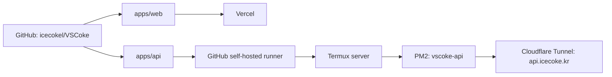
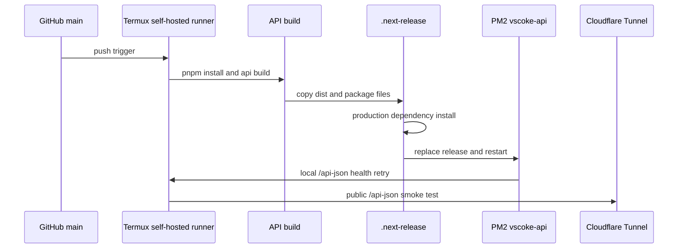

# VSCoke Monorepo Concept

이 문서는 VSCoke를 monorepo로 전환하면서 정한 구조, 배포 방식, 환경 변수 관리, 로컬 작업 방식을 한눈에 이해하기 위한 컨셉 문서다.

상세 배포 절차와 환경 변수 표준은 [Deployment and Environment Plan](./deployment-and-env.md)을 기준으로 한다.

## 목표

VSCoke는 하나의 GitHub 저장소에서 웹과 API를 함께 관리하되, 배포 주체와 런타임은 앱별로 분리한다.

```txt
VSCoke repository
├─ apps/web  -> Vercel
└─ apps/api  -> Termux server -> PM2 -> Cloudflare Tunnel
```

이 구조의 목적은 다음과 같다.

- 웹과 API 코드를 하나의 변경 단위로 추적한다.
- 공통 타입, 설정, 도구를 monorepo 안에서 점진적으로 공유할 수 있게 한다.
- 기존 Termux 서버와 Cloudflare Tunnel 운영 흐름은 유지한다.
- 백엔드 standalone 저장소는 monorepo 배포가 안정화된 뒤 archive한다.

## 저장소 구조

현재 목표 구조는 다음과 같다.

```txt
vscoke/
├─ apps/
│  ├─ web/
│  │  └─ Next.js application
│  └─ api/
│     └─ NestJS application
├─ packages/
│  ├─ api-types/
│  └─ config/
├─ docs/
├─ package.json
├─ pnpm-lock.yaml
└─ pnpm-workspace.yaml
```

루트 `package.json`은 workspace 전체 명령을 담당한다. `apps/web/package.json`과 `apps/api/package.json`은 각 앱의 실행, 빌드, 테스트 의존성을 담당한다.

## 배포 컨셉

웹과 API는 같은 저장소에 있지만 같은 플랫폼으로 배포하지 않는다.



웹은 Vercel Git integration이 담당한다. Vercel 프로젝트의 Root Directory는 `apps/web`이다.

API는 GitHub Actions workflow가 담당한다. workflow는 GitHub-hosted runner에서 SSH로 접속하지 않고, Termux 서버에 설치된 self-hosted runner에서 직접 실행된다.

## API 배포 런타임

Termux는 Android 환경이라 GitHub runner 공식 Linux ARM64 바이너리를 바로 실행하기 어렵다. 그래서 runner 본체는 Ubuntu/proot 안에서 실행하고, 실제 API 배포 명령은 Termux native runtime을 사용한다.

```txt
Termux PM2
└─ github-runner-vscoke
   └─ proot-distro ubuntu
      └─ GitHub runner: termux-vscoke-api
         └─ workflow steps
            ├─ PATH=/data/data/com.termux/files/usr/bin:$PATH
            ├─ HOME=/data/data/com.termux/files/home
            └─ PM2_HOME=/data/data/com.termux/files/home/.pm2
```

중요한 운영 값은 다음과 같다.

| 항목              | 값                                                      |
| ----------------- | ------------------------------------------------------- |
| Runner process    | `github-runner-vscoke`                                  |
| Runner name       | `termux-vscoke-api`                                     |
| Runner labels     | `self-hosted`, `Linux`, `ARM64`, `termux`, `vscoke-api` |
| API PM2 app       | `vscoke-api`                                            |
| API deploy path   | `/data/data/com.termux/files/home/projects/vscoke-api`  |
| API entrypoint    | `apps/api/dist/src/main.js`                             |
| API health check  | `http://127.0.0.1:$PORT/api-json`                       |
| Public API health | `https://api.icecoke.kr/api-json`                       |

## API 배포 흐름

API 관련 파일이 `main`에 들어오면 `.github/workflows/deploy-api.yml`이 실행된다.



배포 workflow는 staging이 성공하기 전에는 기존 PM2 프로세스를 건드리지 않는다. PM2 재시작 후 API listen 타이밍 차이를 고려해 local health check는 재시도한다.

## 환경 변수 컨셉

환경 변수는 Git에 커밋하지 않는다. 앱별로 관리 위치를 분리한다.

| 영역           | 위치                                   | 설명                        |
| -------------- | -------------------------------------- | --------------------------- |
| Web production | Vercel Project Settings                | `NEXT_PUBLIC_API_URL`, Auth |
| Web local      | 루트 `.env.local` 또는 `apps/web/.env` | 웹 로컬 개발                |
| API production | Termux `~/projects/vscoke-api/.env`    | PM2 API 런타임              |
| API local      | `apps/api/.env`                        | 로컬 API 작업과 테스트      |
| DB tunnel      | `apps/api/.env`의 `CLOUDFLARE_DB_HOST` | Mac에서 DB 접근할 때 사용   |

현재 로컬 API 작업용 `.env`는 기존 백엔드 저장소의 `.env`를 `apps/api/.env`로 복사해 사용한다. 이 파일은 `apps/api/.gitignore`에 의해 무시된다.

## DB 접속 컨셉

운영 API와 로컬 개발자의 DB 접근 방식은 다르다.

운영 API는 Termux 서버 안에서 PostgreSQL에 붙는다.

```txt
apps/api on Termux -> DB_HOST=localhost -> PostgreSQL on Termux
```

로컬 Mac에서 API 작업이나 DB 확인이 필요하면 Cloudflare Access TCP tunnel을 먼저 띄운다.

```txt
Mac localhost:5432 -> cloudflared access tcp -> pd.icecoke.kr -> PostgreSQL on Termux
```

로컬 터널 실행:

```bash
cd /Users/smlee/vscoke/worktrees/ci/self-hosted-api-deploy
pnpm --filter @vscoke/api db:tunnel
```

터널을 띄운 터미널은 유지해야 한다. 다른 터미널에서 API 테스트나 DB 확인을 수행한다.

## 현재 검증된 상태

2026-06-16 기준 다음 항목을 확인했다.

- Vercel Root Directory가 `apps/web`으로 설정되어 production 배포가 성공했다.
- Termux self-hosted runner가 online 상태다.
- API 배포 workflow가 self-hosted runner에서 실행된다.
- API build, staging, PM2 restart, local health check, public smoke test가 성공했다.
- 성공한 API 배포 run: `27598267438`
- Termux PM2에서 `github-runner-vscoke`와 `vscoke-api`가 online 상태다.
- 로컬 Mac에서 Cloudflare DB tunnel을 띄운 뒤 DB 연결 SQL이 성공했다.

## 작업 기준

앞으로 API 작업은 monorepo의 `apps/api`에서 진행한다.

```bash
cd /Users/smlee/vscoke/worktrees/ci/self-hosted-api-deploy
pnpm --filter @vscoke/api test
pnpm --filter @vscoke/api build
```

DB가 필요한 작업은 별도 터미널에서 tunnel을 먼저 켠다.

```bash
pnpm --filter @vscoke/api db:tunnel
```

웹 작업은 `apps/web` 기준으로 진행하고, API 공개 주소는 Vercel 환경 변수 `NEXT_PUBLIC_API_URL`에서 관리한다.

## 남은 결정

- 메인 작업 디렉터리 `/Users/smlee/vscoke`를 최신 monorepo `main`으로 전환할지 결정한다.
- 기존 standalone `vscoke-api` 저장소를 언제 archive할지 결정한다.
- `packages/api-types`에 API 공유 타입을 실제로 생성할지 결정한다.
- GitHub Actions의 `actions/checkout@v4` Node.js 20 deprecation 경고를 언제 정리할지 결정한다.
- Cloudflare DB tunnel `pd.icecoke.kr`을 장기 유지할지, 로컬 개발 전용으로만 유지할지 결정한다.
