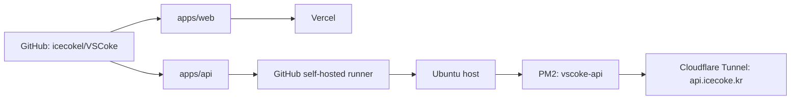

# VSCoke Monorepo Concept

확인 기준일: 2026-07-06

이 문서는 현재 구현된 VSCoke monorepo의 구조, 실행 방식, 테스트, 배포 흐름을 한눈에 보기 위한 기준 문서다. 프론트엔드, 백엔드, 테스트, hook 작업을 시작할 때는 이 문서를 먼저 확인한다.

상세 실행 절차는 [Local Development](./local-development.md), 배포와 환경 변수 세부 기준은 [Deployment and Environment Plan](./deployment-and-env.md), 장애 대응은 [Operations Runbook](./operations-runbook.md), 게임 랭킹 검증은 [Game Score Policy](./game-score-policy.md)를 따른다.

## 현재 구조

VSCoke는 하나의 GitHub 저장소에서 Next.js 웹 앱과 NestJS API를 함께 관리한다. 저장소는 하나지만 배포 주체와 런타임은 앱별로 분리한다.

```txt
vscoke/
├─ apps/
│  ├─ web/      -> Next.js 15 App Router frontend
│  └─ api/      -> NestJS 11 backend
├─ packages/
│  ├─ api-types/  -> future shared package placeholder
│  └─ config/     -> future shared package placeholder
├─ docs/
├─ scripts/
├─ package.json
├─ pnpm-lock.yaml
└─ pnpm-workspace.yaml
```

`pnpm-workspace.yaml`은 `apps/*`, `packages/*`를 workspace로 묶는다. 현재 `packages/api-types`, `packages/config`는 자리 표시자만 있고 실제 공유 패키지 구현은 없다.

## 앱 책임

### Web: `apps/web`

웹 앱은 Vercel에 배포되는 Next.js App Router 앱이다.

주요 구성:

- Next.js 15, React 19, TypeScript
- next-intl 기반 `ko-KR`, `en-US` 라우팅
- Tailwind CSS 4
- Auth.js / Google OAuth
- Playwright E2E

현재 주요 라우트:

| 영역           | 라우트                                                                                                         |
| -------------- | -------------------------------------------------------------------------------------------------------------- |
| 홈             | `/:locale`                                                                                                     |
| 문서/이력      | `/:locale/readme`, `/:locale/resume/:slug`, `/:locale/package`                                                 |
| 블로그         | `/:locale/blog`, `/:locale/blog/:slug`, `/:locale/blog/dashboard`                                              |
| 게임           | `/:locale/game`, `/:locale/game/sky-drop`, `/:locale/game/fish-drift`, `/:locale/game/wordle`, `/:locale/doom` |
| 취미           | `/:locale/hobby/espresso`, `/:locale/hobby/espresso/:beanId`, `/:locale/hobby/recipes`                         |
| 공유           | `/:locale/share/:id`                                                                                           |
| Next API route | `/api/auth/[...nextauth]`, `/api/hobby-search-index`                                                           |

웹은 API 코드를 직접 import하지 않는다. 브라우저에서 필요한 API 주소는 `NEXT_PUBLIC_API_URL`로 주입한다.

### API: `apps/api`

API는 Ubuntu 호스트에서 PM2로 실행되는 NestJS 앱이다.

주요 구성:

- NestJS 11, TypeScript
- TypeORM + PostgreSQL
- Swagger UI `/api`, OpenAPI JSON `/api-json`
- Winston logging
- Google ID token 기반 API 인증 guard
- 개발 환경 전용 auth bypass 옵션

현재 API 모듈:

| 모듈            | 주요 endpoint                                                    | 설명                            |
| --------------- | ---------------------------------------------------------------- | ------------------------------- |
| App             | `GET /`                                                          | 기본 상태 확인                  |
| Recipe          | `GET /recipes`, `GET /recipes/:id`                               | 취미 레시피 목록/상세           |
| EspressoHistory | `GET /espresso-history/beans`, `GET /espresso-history/beans/:id` | 에스프레소 원두/라운드 기록     |
| Game            | `POST /game/result`, `GET /game/ranking`, `GET /game/result/:id` | 게임 점수 저장, 랭킹, 공유 조회 |
| Wordle          | `GET /wordle/word`, `POST /wordle/check`                         | Wordle 단어 조회/검증           |

DB 연결은 API 런타임에서만 관리한다. 웹은 DB에 직접 접근하지 않는다.

## 데이터와 타입 흐름

```txt
apps/api controller/dto
-> Swagger /api-json
-> apps/web generate:types
-> apps/web service layer
-> page/component
```

프론트 타입 갱신은 공개 API의 OpenAPI JSON을 기준으로 한다.

```bash
pnpm generate:types
```

취미 검색은 브라우저가 외부 API를 직접 조합하지 않고, 같은 origin의 Next route를 거친다.

```txt
SearchPanel
-> /api/hobby-search-index
-> apps/web service layer
-> NEXT_PUBLIC_API_URL
-> apps/api
```

## 로컬 실행 기준

기본 명령은 저장소 루트에서 실행한다.

```bash
corepack enable
corepack prepare pnpm@9.12.0 --activate
pnpm install
```

주요 루트 스크립트:

| 목적              | 명령                    |
| ----------------- | ----------------------- |
| 웹 개발           | `pnpm dev:web`          |
| API 개발          | `pnpm dev:api`          |
| 전체 빌드         | `pnpm build`            |
| 웹 빌드           | `pnpm build:web`        |
| API 빌드          | `pnpm build:api`        |
| 전체 lint         | `pnpm lint`             |
| 웹 typecheck      | `pnpm type:check:web`   |
| API unit test     | `pnpm test:api`         |
| API E2E test      | `pnpm test:api:e2e`     |
| 웹 E2E smoke      | `pnpm e2e:smoke`        |
| 웹 E2E 전체       | `pnpm e2e`              |
| unused code check | `pnpm knip`             |
| 공개 API health   | `pnpm smoke:api:remote` |

API와 웹을 동시에 로컬에서 볼 때는 터미널을 나눈다.

```bash
PORT=3001 pnpm dev:api
NEXT_PUBLIC_API_URL=http://localhost:3001 pnpm dev:web
```

## 환경 변수 기준

환경 변수는 Git에 커밋하지 않는다.

| 영역      | 로컬 위치                           | 운영 위치                                           |
| --------- | ----------------------------------- | --------------------------------------------------- |
| Web       | `apps/web/.env.local` 또는 실행 env | Vercel Project Settings                             |
| API       | `apps/api/.env`                     | Ubuntu host `/home/icenux/projects/vscoke-api/.env` |
| DB tunnel | `apps/api/.env`                     | 로컬 개발 보조 전용                                 |

중요한 값:

- Web: `NEXT_PUBLIC_API_URL`, `AUTH_GOOGLE_ID`, `AUTH_GOOGLE_SECRET`, `AUTH_SECRET`, optional `AUTH_URL`
- API: `PORT`, `CORS_ORIGINS`, `GOOGLE_CLIENT_ID`, `DB_*`, `DB_SYNCHRONIZE`, optional notify env
- 개발 전용: `ENABLE_DEV_AUTH_BYPASS`, `DEV_AUTH_TOKEN`, `CLOUDFLARE_DB_HOST`

운영 API에서는 `DB_SYNCHRONIZE=false`를 명시한다.

## 테스트와 hook

로컬 Git hook:

| Hook         | 실행 내용                                                          |
| ------------ | ------------------------------------------------------------------ |
| `pre-commit` | `lint-staged`                                                      |
| `commit-msg` | 한국어 커밋 메시지 규칙 검증                                       |
| `pre-push`   | `pnpm type:check:web`, `pnpm lint`, `pnpm build`, `pnpm e2e:smoke` |

PR 자동 검증은 `.github/workflows/pull-request-check.yml`이 담당한다.

| Job | 주요 검증                                            |
| --- | ---------------------------------------------------- |
| API | API lint, unit test, E2E test, build                 |
| Web | typecheck, lint, knip, build, focused Playwright E2E |

PR의 focused E2E는 현재 `i18n-integrity`, `hobby-games`, `keyboard-only`를 Chromium에서 실행한다. 전체 Playwright 회귀는 로컬에서 필요에 따라 `pnpm e2e` 또는 `pnpm e2e:cross-browser`로 실행한다.

## 배포 구조



웹 배포:

- Vercel Git integration이 담당한다.
- Vercel Root Directory는 `apps/web`이다.
- Vercel은 `apps/web/package.json`의 `build`를 실행한다.

API 배포:

- `.github/workflows/deploy-api.yml`이 담당한다.
- `main` push 중 `apps/api/**`, 루트 package/lock/workspace 파일, API deploy workflow 변경이 있을 때 실행된다.
- runner labels는 `self-hosted`, `vscoke-api`, `host`를 사용한다.
- 배포 산출물은 Ubuntu host `/home/icenux/projects/vscoke-api`에 staged release로 반영된다.
- PM2 앱 이름은 `vscoke-api`, entrypoint는 `apps/api/dist/src/main.js`다.
- 배포 후 local `/health`와 public `https://api.icecoke.kr/health`를 확인한다.
- 이전 `/opt/icenux/vscoke-api` 기반 `vscoke-api-native.service`는 사용하지 않으며, host PM2 프로세스가 운영 API를 단독으로 관리한다.

## DB 접속 기준

운영 API는 Ubuntu host 내부 PostgreSQL에 붙는다.

```txt
apps/api on Ubuntu host -> DB_HOST=127.0.0.1 -> PostgreSQL on Ubuntu host
```

Mac 로컬에서 DB가 필요한 작업을 할 때는 Cloudflare Access TCP tunnel을 먼저 띄운다.

```bash
pnpm --filter @vscoke/api db:tunnel
```

터널 터미널은 유지하고, 다른 터미널에서 API 실행이나 DB 확인을 진행한다.

## 작업 원칙

- 백엔드 코드는 외부 저장소가 아니라 이 workspace의 `apps/api`에서 관리한다.
- 웹 코드는 `apps/web`에서 관리한다.
- 루트 `pnpm-workspace.yaml`과 루트 `package.json` scripts를 기준으로 작업한다.
- `/Users/smlee/vscoke-api` 같은 외부 경로는 사용자가 명시적으로 요청하지 않는 한 코드 변경 대상으로 삼지 않는다.
- API 계약이 바뀌면 Swagger DTO, `/api-json`, `apps/web/src/types/api.d.ts`, service layer를 함께 확인한다.
- E2E 산출물인 `.next-e2e*`, `playwright-report`, `test-results`는 Git에 포함하지 않는다.

## 관련 문서

- [Local Development](./local-development.md)
- [Deployment and Environment Plan](./deployment-and-env.md)
- [Operations Runbook](./operations-runbook.md)
- [Hobby API Swagger Concept](./hobby-api-swagger-concept.md)
- [Hobby Frontend Schema Concept](./hobby-frontend-schema-concept.md)
- [Playwright CLI Test Spec](./playwright-cli-test-spec.md)
