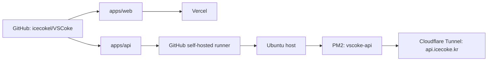

# VSCoke Monorepo Concept

확인 기준일: 2026-07-16

이 문서는 현재 구현된 VSCoke monorepo의 구조, 실행 방식, 테스트, 배포 흐름을 한눈에 보기 위한 기준 문서다. 프론트엔드, 백엔드, 테스트, hook 작업을 시작할 때는 이 문서를 먼저 확인한다.

상세 실행 절차는 [Local Development](./local-development.md), 배포와 환경 변수 세부 기준은 [Deployment and Environment Plan](./deployment-and-env.md), 장애 대응은 [Operations Runbook](./operations-runbook.md), 게임 랭킹 검증은 [Game Score Policy](./game-score-policy.md)를 따른다.

## 현재 구조

VSCoke는 하나의 GitHub 저장소에서 Next.js 웹 앱과 NestJS API를 함께 관리한다. 저장소는 하나지만 배포 주체와 런타임은 앱별로 분리한다.

```txt
vscoke/
├─ apps/
│  ├─ web/      -> Next.js 15 App Router frontend
│  └─ api/      -> NestJS 11 backend
├─ packages/
│  ├─ api-types/  -> shared package placeholder (.gitkeep only)
│  ├─ config/     -> shared package placeholder (.gitkeep only)
│  └─ poke-lounge-battle/ -> shared deterministic competitive battle engine
├─ docs/
├─ scripts/
├─ package.json
├─ pnpm-lock.yaml
└─ pnpm-workspace.yaml
```

`pnpm-workspace.yaml`은 `apps/*`, `packages/*`를 workspace로 묶는다. `@vscoke/poke-lounge-battle`은 Web과 API가 함께 사용하는 결정론적 경쟁 전투 규칙, canonical state, PRNG, turn resolver와 2~6인 토너먼트 bracket/bye 규칙을 제공한다. `packages/api-types`, `packages/config`는 `.gitkeep`만 있는 자리 표시자다.

## 앱 책임

### Web: `apps/web`

웹 앱은 Vercel에 배포되는 Next.js App Router 앱이다.

주요 구성:

- Next.js 15, React 19, TypeScript
- next-intl 기반 `ko-KR`, `en-US` 라우팅
- Tailwind CSS 4
- Auth.js / Google OAuth
- 선택적 GA4/GTM 클라이언트 계측
- Playwright E2E

현재 주요 라우트:

| 영역           | 라우트                                                                                                                     |
| -------------- | -------------------------------------------------------------------------------------------------------------------------- |
| 홈             | `/:locale`                                                                                                                 |
| 문서/이력      | `/:locale/readme`, `/:locale/resume/:slug`, `/:locale/resume/question`, `/:locale/package`                                 |
| 블로그         | `/:locale/blog`, `/:locale/blog/:slug`, `/:locale/blog/dashboard`                                                          |
| 게임           | `/:locale/game`, `/:locale/game/sky-drop`, `/:locale/game/fish-drift`, `/:locale/game/poke-lounge`, `/:locale/game/wordle` |
| 취미           | `/:locale/hobby/espresso`, `/:locale/hobby/espresso/:beanId`, `/:locale/hobby/recipes`                                     |
| 공유           | `/:locale/share/:id`                                                                                                       |
| Next API route | `/api/auth/[...nextauth]`, `/api/hobby-search-index`                                                                       |

웹은 API 코드를 직접 import하지 않는다. 브라우저에서 필요한 API 주소는 `NEXT_PUBLIC_API_URL`로 주입한다.

### API: `apps/api`

API는 Ubuntu 호스트에서 PM2로 실행되는 NestJS 앱이다.

주요 구성:

- NestJS 11, TypeScript
- TypeORM + PostgreSQL
- Swagger UI `/api`, OpenAPI JSON `/api-json`
- Winston logging
- Google ID token 기반 API 인증 guard
- 개발 환경 전용 auth bypass 옵션
- 공개 origin allowlist 기반 Resume RAG guard

현재 API 모듈:

| 모듈            | 주요 endpoint                                                                                             | 설명                             |
| --------------- | --------------------------------------------------------------------------------------------------------- | -------------------------------- |
| App             | `GET /`, `GET /health`                                                                                    | 기본 상태와 health 확인          |
| Recipe          | `GET /recipes`, `GET /recipes/:id`                                                                        | 취미 레시피 목록/상세            |
| EspressoHistory | `GET /espresso-history/beans`, `GET /espresso-history/beans/:id`                                          | 에스프레소 원두/라운드 기록      |
| Game            | `POST /game/result`, `GET /game/ranking`, `GET /game/result/:id`, `GET/PUT /game/poke-lounge/state`       | 게임 점수, 랭킹, 공유, 저장 상태 |
| PokeLounge      | `POST /poke-lounge/rooms`, `GET /poke-lounge/rooms/:roomCode`, join/ready/snapshot/result/leave room APIs | Poke Lounge 서버 룸 상태         |
| ResumeRag       | `POST /resume-rag/chat`                                                                                   | 공개 이력 질문 답변              |
| Wordle          | `GET /wordle/word`, `POST /wordle/check`                                                                  | Wordle 단어 조회/검증            |

DB 연결은 API 런타임에서만 관리한다. 웹은 DB에 직접 접근하지 않는다.

## 데이터와 타입 흐름

```txt
apps/api controller/dto
-> local OpenAPI contract apps/api/openapi.json
-> apps/web generate:types
-> apps/web service layer
-> page/component
```

프론트 타입 갱신은 현재 커밋의 API controller/DTO에서 생성한 로컬 OpenAPI JSON을 기준으로 한다. 운영 Swagger는 배포된 API 확인용으로 유지하지만, 개발/CI의 타입 생성 source of truth로 사용하지 않는다.

```bash
pnpm generate:types
```

이 명령은 먼저 `apps/api/openapi.json`을 생성한 뒤 `apps/web/src/types/api.d.ts`를 갱신한다. 계약 파일과 타입 파일이 갱신되지 않은 상태는 CI의 `pnpm check:api-contract`에서 diff로 잡는다.

취미 검색은 브라우저가 외부 API를 직접 조합하지 않고, 같은 origin의 Next route를 거친다.

```txt
SearchPanel
-> /api/hobby-search-index
-> apps/web service layer
-> NEXT_PUBLIC_API_URL
-> apps/api
```

이력 질문은 로그인 없이 동작하지만 API는 허용된 브라우저 origin만 받는다.

```txt
/:locale/readme composer or /:locale/resume/question
-> apps/web resume-rag service
-> POST /resume-rag/chat
-> apps/api ResumeRagModule
-> resume_source_items DB text search
-> Codex app-server answer generation
```

Poke Lounge는 저장 상태, durable room, 인증 경쟁 경로를 분리한다.

```txt
authenticated Web
-> GET /game/poke-lounge/state
-> validate versioned snapshot
-> hydrate local-player store
-> start Phaser and autosave PUT
```

서버 GET이 없거나 로그인하지 않은 경우 Phaser는 versioned `sessionStorage` local-player snapshot으로 시작한다. 인증 GET이 실패하면 로컬 상태로 게임을 시작하되 원격 autosave는 재시도 전까지 열지 않아 서버 상태를 덮어쓰지 않는다. `localStorage`의 legacy key는 제거한다.

```txt
room mutation + X-Idempotency-Key + If-Match-Revision
-> PostgreSQL transaction
-> poke_lounge_room snapshot/revision/TTL
-> poke_lounge_room_command durable receipt
-> commit
-> Socket.IO /poke-lounge room.snapshot
```

Web은 REST GET으로 room을 초기화하고 Socket.IO committed snapshot을 적용한다. 연결 장애, 재연결, revision conflict에서는 REST GET을 복구 경로로 사용한다. 750 ms 상시 polling이나 API 프로세스 메모리 Map은 현재 구조가 아니다.

authority terminal은 한 public snapshot 안에서 완료된 이전 match와 현재 assignment를 분리한다. `competitiveTransitions`는 terminal event ID/revision을 가진 완료 projection만 담고, optional `competitive`는 현재 assignment만 담는다. 서버는 terminal metadata, bracket 전진, 다음 assignment와 receipt를 한 transaction으로 commit한 뒤 composite snapshot 하나를 발행한다. `competitive`가 없을 때는 필드를 생략하며 `null`로 만들지 않는다.

Web은 current assignment cache, 최근 terminal transition cache, room cursor, terminal cursor를 별도로 유지한다. terminal transition은 event ID/match ID로 dedup하여 current assignment보다 먼저 적용하고, 성공한 뒤에만 terminal cursor를 전진시킨다. 같은 페이지의 Socket reconnect와 mismatch recovery는 이 cursor를 `afterRevision`으로 전송해 순서대로 복구한다. full reload는 initial room revision을 새 baseline으로 사용하며 persisted cursor를 복원하지 않는다. CSP `connect-src`는 허용한 HTTP(S) API origin과 대응 WS(S) origin을 함께 허용해 Socket.IO WebSocket transport를 지원한다.

서버 room의 `tournament.version = 2` snapshot은 공통 package가 만든 bracket, bye, stable `activeMatchId`와 match authority를 함께 보관한다. 참가자 seed는 join 순서와 player ID로 서버에서 확정하며 Web은 참가자 배열로 대진을 다시 만들지 않는다. 5인 첫 bracket은 `seed 4 vs 5`와 `seed 1/3/2 bye`로 시작한다. 여러 2인 경기는 동시에 열지 않고 서버가 한 match씩 순차 활성화한다.

서로 다른 인증 계정이 좌석을 바인딩한 active match에서는 각 계정이 자기 action만 제출할 수 있고 서버는 `@vscoke/poke-lounge-battle`의 서버 seed, canonical state와 turn을 전진시킨다. 정확히 2명인 `ranked-head-to-head` terminal은 승자 100점, 패자 50점의 `verified-room` 이력을 한 트랜잭션으로 기록한다. 3~6인 bracket의 `tournament-unranked` authority match는 같은 결정론적 전투와 durable receipt를 사용하지만 bracket만 전진시키고 공개 랭킹 이력을 만들지 않는다.

authority assignment가 없는 casual active match는 `POST /poke-lounge/rooms/:roomCode/result`로 진행한다. 이 결과와 solo/일반 `POST /game/result`는 client-asserted unranked이며 공개 Poke Lounge 랭킹에 반영되지 않는다. Web은 `activeMatchAuthority`에 따라 authority action과 casual result transport를 배타적으로 선택한다.

Phaser `WorldScene`은 orchestration 경계로 남고 HUD, interactions, tournament, encounters를 `world-scene-*.ts` collaborator로 분리했다. 상세 계약과 구현 결과는 [Poke Lounge Hardening Report](./poke-lounge-hardening-report.md)를 따른다.

### Poke Lounge 공개 배포 제한

Poke Lounge의 현재 구현과 서버 API는 기술적 MVP로 저장소에 존재한다. 런타임 오디오는 2026-07-12에 출처와 CC0 라이선스가 확인된 자료로 교체했다. 다만 공개 에셋에는 ROM-derived로 확인된 게임 데이터와 출처가 확인되지 않은 Pokémon 스프라이트, 텍스처, 맵이 남아 있으므로 공개 배포의 권리 위험은 해결되지 않았다.

`pnpm check:poke-lounge-provenance`는 이 권리 상태를 엄격하게 검증한다. 오디오 9개 행은 승인됐지만 나머지 57개 행이 `blocked`이므로 명령은 계속 실패한다. 기본 Vercel 빌드는 이를 자동 차단하지 않으며, `POKE_LOUNGE_PROVENANCE_STRICT=1`일 때만 배포 빌드에서 강제한다. Phase 3의 기술적 MVP 완료, 서버 권위 검증 통과 또는 배포 성공을 권리 승인으로 해석하지 않는다. 상세 인벤토리는 [Poke Lounge Asset Provenance](./poke-lounge-asset-provenance.md)를 따른다.

## 로컬 실행 기준

기본 명령은 저장소 루트에서 실행한다.

```bash
corepack enable
corepack prepare pnpm@9.12.0 --activate
pnpm install
```

주요 루트 스크립트:

| 목적              | 명령                                        |
| ----------------- | ------------------------------------------- |
| 웹 개발           | `pnpm dev:web`                              |
| API 개발          | `pnpm dev:api`                              |
| 전체 빌드         | `pnpm build`                                |
| 웹 빌드           | `pnpm build:web`                            |
| API 빌드          | `pnpm build:api`                            |
| 전체 lint         | `pnpm lint`                                 |
| 웹 typecheck      | `pnpm type:check:web`                       |
| API unit test     | `pnpm test:api`                             |
| API E2E test      | `pnpm test:api:e2e`                         |
| OpenAPI 생성      | `pnpm generate:types`                       |
| API 계약 확인     | `pnpm check:api-contract`                   |
| 웹 E2E smoke      | `pnpm e2e:smoke`                            |
| 웹 E2E 전체       | `pnpm e2e`                                  |
| 5인 통합 E2E      | `pnpm --filter @vscoke/web e2e:integration` |
| unused code check | `pnpm knip`                                 |
| 공개 API health   | `pnpm smoke:api:remote`                     |

API와 웹을 동시에 로컬에서 볼 때는 터미널을 나눈다.

```bash
PORT=3001 pnpm dev:api
NEXT_PUBLIC_API_URL=http://localhost:3001 pnpm dev:web
```

## 환경 변수 기준

환경 변수는 Git에 커밋하지 않는다.

| 영역      | 로컬 위치                           | 운영 위치                                           |
| --------- | ----------------------------------- | --------------------------------------------------- |
| Web       | `apps/web/.env.local` 또는 실행 env | Vercel Project Settings                             |
| API       | `apps/api/.env`                     | Ubuntu host `/home/icenux/projects/vscoke-api/.env` |
| DB tunnel | `apps/api/.env`                     | 로컬 개발 보조 전용                                 |

중요한 값:

- Web: `NEXT_PUBLIC_API_URL`, `AUTH_GOOGLE_ID`, `AUTH_GOOGLE_SECRET`, `AUTH_SECRET`, optional `AUTH_URL`, optional GA4/GTM env
- API: `PORT`, `CORS_ORIGINS`, `GOOGLE_CLIENT_ID`, `DB_*`, `DB_SYNCHRONIZE`, Resume RAG env, optional notify env
- 개발 전용: `ENABLE_DEV_AUTH_BYPASS`, `DEV_AUTH_TOKEN`, `CLOUDFLARE_DB_HOST`

운영 API에서는 `DB_SYNCHRONIZE=false`를 명시한다.

## 테스트와 hook

로컬 Git hook:

| Hook         | 실행 내용                                                          |
| ------------ | ------------------------------------------------------------------ |
| `pre-commit` | `lint-staged`                                                      |
| `commit-msg` | 한국어 커밋 메시지 규칙 검증                                       |
| `pre-push`   | `pnpm type:check:web`, `pnpm lint`, `pnpm build`, `pnpm e2e:smoke` |

PR 자동 검증은 `.github/workflows/pull-request-check.yml`이 담당한다.

| Job | 주요 검증                                                                         |
| --- | --------------------------------------------------------------------------------- |
| API | PostgreSQL 16 service, test migration, API lint/unit/integration/E2E, build       |
| Web | local OpenAPI contract diff, typecheck, lint, knip, build, focused Playwright E2E |

PR의 focused E2E는 `i18n-integrity`, `hobby-games`, `keyboard-only`, `poke-lounge-multiplayer`를 Chromium에서 실행한다. Chromium/WebKit mobile의 Poke Lounge spec 수집 수가 각각 정확히 1건인지 별도 preflight로 확인한다. 실제 API, PostgreSQL, Socket.IO와 Desktop Chromium/Firefox/WebKit, Mobile Chromium/WebKit의 5개 context를 함께 여는 통합 E2E는 격리 `_test` DB가 필요한 로컬 release gate다.

```bash
PLAYWRIGHT_WORKERS=1 \
PLAYWRIGHT_ENABLE_CROSS_BROWSER=1 \
TEST_DATABASE_URL="$TEST_DATABASE_URL" \
pnpm --filter @vscoke/web e2e:integration -- \
  tests/e2e/poke-lounge-five-player-tournament.spec.ts
```

전용 runner는 migration을 적용하고 테스트 전용 Nest TestingModule에서만 다섯 bearer identity를 제공한다. room/action REST와 Socket.IO는 mock하지 않으며 `/api/auth/session`만 context별 Web session 경계로 대체한다. 결과와 환경 probe는 `output/playwright/poke-lounge-five-player/<run-id>/`에 기록하며 runner/API 로그에서는 테스트 DB URL·비밀번호와 E2E token/session을 제거한다.

## 배포 구조



웹 배포:

- Vercel Git integration이 담당한다.
- Vercel Root Directory는 `apps/web`이다.
- Vercel은 `apps/web/package.json`의 `build`를 실행한다.

API 배포:

- `.github/workflows/deploy-api.yml`이 담당한다.
- `main` push 중 `apps/api/**`, 루트 package/lock/workspace 파일, API deploy workflow 변경이 있을 때 실행된다.
- runner labels는 `self-hosted`, `vscoke-api`, `host`를 사용한다.
- 배포 산출물은 Ubuntu host `/home/icenux/projects/vscoke-api`에 staged release로 반영된다.
- PM2 앱 이름은 `vscoke-api`, entrypoint는 `apps/api/dist/src/main.js`다.
- 배포 후 local `/health`와 public `https://api.icecoke.kr/health`를 확인한다.
- 이전 `/opt/icenux/vscoke-api` 기반 `vscoke-api-native.service`는 사용하지 않으며, host PM2 프로세스가 운영 API를 단독으로 관리한다.

## DB 접속 기준

운영 API는 Ubuntu host 내부 PostgreSQL에 붙는다.

```txt
apps/api on Ubuntu host -> DB_HOST=127.0.0.1 -> PostgreSQL on Ubuntu host
```

Mac 로컬에서 DB가 필요한 작업을 할 때는 Cloudflare Access TCP tunnel을 먼저 띄운다.

```bash
pnpm --filter @vscoke/api db:tunnel
```

터널 터미널은 유지하고, 다른 터미널에서 API 실행이나 DB 확인을 진행한다.

## 작업 원칙

- 백엔드 코드는 외부 저장소가 아니라 이 workspace의 `apps/api`에서 관리한다.
- 웹 코드는 `apps/web`에서 관리한다.
- 루트 `pnpm-workspace.yaml`과 루트 `package.json` scripts를 기준으로 작업한다.
- `/Users/smlee/vscoke-api` 같은 외부 경로는 사용자가 명시적으로 요청하지 않는 한 코드 변경 대상으로 삼지 않는다.
- API 계약이 바뀌면 Swagger DTO, `apps/api/openapi.json`, `apps/web/src/types/api.d.ts`, service layer를 함께 확인한다.
- E2E 산출물인 `.next-e2e*`, `playwright-report`, `test-results`는 Git에 포함하지 않는다.

## 관련 문서

- [Local Development](./local-development.md)
- [Deployment and Environment Plan](./deployment-and-env.md)
- [Operations Runbook](./operations-runbook.md)
- [Hobby API Swagger Concept](./hobby-api-swagger-concept.md)
- [Hobby Frontend Schema Concept](./hobby-frontend-schema-concept.md)
- [Playwright CLI Test Spec](./playwright-cli-test-spec.md)
- [Poke Lounge Game Concept](./poke-lounge-game-concept.md)
- [Poke Lounge Hardening Report](./poke-lounge-hardening-report.md)
- [Poke Lounge Release Gate](./poke-lounge-release-gate.md)
