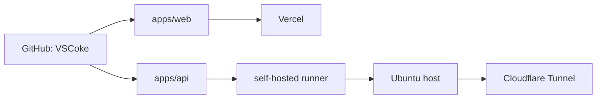

# VSCoke Monorepo Concept

확인 기준일: 2026-08-20

이 문서는 VSCoke monorepo의 앱 책임, 경계와 데이터 흐름을 설명한다. 실행 명령은
[Local Development](./local-development.md), 배포와 환경 변수는
[Deployment and Environment Plan](./deployment-and-env.md), 장애 대응은
[Operations Runbook](./operations-runbook.md)을 기준으로 한다.

## 현재 구조

VSCoke는 하나의 GitHub 저장소에서 Next.js 웹 앱과 NestJS API를 함께 관리한다. 저장소는
하나지만 배포 주체와 런타임은 앱별로 분리한다.

```txt
vscoke/
├─ apps/
│  ├─ web/      -> Next.js App Router frontend
│  └─ api/      -> NestJS backend
├─ packages/
│  └─ poke-lounge-battle/ -> Web/API 공유 결정론적 전투 규칙
├─ docs/
├─ scripts/
├─ package.json
├─ pnpm-lock.yaml
└─ pnpm-workspace.yaml
```

`pnpm-workspace.yaml`은 `apps/*`, `packages/*`를 workspace로 묶는다. 루트 package scripts는 각
workspace 명령의 공통 진입점이다.

## 앱 책임

### Web: `apps/web`

웹 앱은 Vercel에 배포되는 Next.js App Router 앱이다.

- 포트폴리오, 이력, 게임과 취미 화면을 렌더링한다.
- `next-intl`로 locale route를 관리한다.
- Auth.js로 선택적 Google 로그인을 처리한다.
- 브라우저에서 API를 호출하되 API 소스나 DB를 직접 참조하지 않는다.
- Playwright로 사용자 흐름을 검증한다.

브라우저에서 필요한 API 주소는 `NEXT_PUBLIC_API_URL`로 주입한다. 현재 route와 화면별 검증
범위는 [전체 기능 E2E 테스트 시나리오](./e2e-full-feature-test-scenarios.md)에서 관리한다.

### API: `apps/api`

API는 Ubuntu host에서 실행되는 NestJS 앱이다.

- 취미 데이터, 인증, 게임 결과와 이력 질문 API를 제공한다.
- TypeORM과 PostgreSQL로 영속 상태를 관리한다.
- Poke Lounge room, Socket.IO와 서버 권위 경쟁 상태를 관리한다.
- controller와 DTO에서 Swagger/OpenAPI 계약을 생성한다.
- 요청 로그와 운영 health endpoint를 제공한다.

현재 module과 endpoint 목록은 [VSCoke API README](../apps/api/README.md)를 기준으로 한다.

### Shared package: `packages/poke-lounge-battle`

`@vscoke/poke-lounge-battle`은 Web과 API가 함께 사용하는 결정론적 전투 상태, PRNG, turn
resolver와 bracket 규칙을 제공한다. 브라우저 UI나 API transport 책임은 포함하지 않는다.

## 데이터와 타입 흐름

프론트 타입은 현재 커밋의 API controller/DTO에서 생성한다. 운영 Swagger는 배포 결과 확인용이며
개발·CI 타입 생성 원본으로 사용하지 않는다.

```text
apps/api controller/dto
-> apps/api/openapi.json
-> apps/web/src/types/api.d.ts
-> apps/web service layer
-> page/component
```

갱신 절차는 [Local Development의 API 타입 갱신](./local-development.md#api-타입-갱신)을 따른다.

취미 검색은 브라우저가 외부 API를 직접 조합하지 않고 같은 origin의 Next route를 거친다.

```text
SearchPanel
-> /api/hobby-search-index
-> apps/web service layer
-> NEXT_PUBLIC_API_URL
-> apps/api
```

이력 질문과 메인 채팅은 Web이 VSCoke API만 호출한다. 검색과 AI 답변 생성 경계는
[메인 채팅·이력 질문 AI 사용 지침](./main-chat-ai-usage-guide.md)을 따른다.

```text
Web
-> POST /main-chat or /resume-rag/chat
-> apps/api text retrieval
-> Codex app-server answer generation
```

Poke Lounge는 브라우저 로컬 진행, Redis room·match 상태와 Socket.IO 실시간 전파를
분리한다.

```text
Web local player state
-> REST room command
-> Redis Lua CAS and revision
-> Socket.IO committed snapshot
-> same-room browsers
```

제품 규칙은 [Poke Lounge 게임 규칙 인덱스](./poke-lounge-rules/index.md), 현재 구현 경계는
[Poke Lounge Game Concept](./poke-lounge-game-concept.md)을 따른다.

## 배포 경계


```mermaid
flowchart LR
  Repo["GitHub: VSCoke"]
  Web["apps/web"]
  Api["apps/api"]
  Vercel["Vercel"]
  Runner["self-hosted runner"]
  Host["Ubuntu host"]
  Tunnel["Cloudflare Tunnel"]

  Repo --> Web --> Vercel
  Repo --> Api --> Runner --> Host --> Tunnel
```

웹과 API의 구체적인 build 설정, 경로, 프로세스 이름과 환경 변수는 이 문서에 복제하지 않고
[Deployment and Environment Plan](./deployment-and-env.md)에서 관리한다.

## 작업 경계

- 웹 코드는 `apps/web`, API 코드는 `apps/api`에서 관리한다.
- 양쪽이 공유하는 결정론적 도메인 로직만 `packages`에 둔다.
- 웹에서 API 소스를 직접 import하지 않는다.
- API 계약 변경은 controller/DTO, OpenAPI, Web generated type과 service 사용처를 함께 확인한다.
- 과거 `docs/superpowers/` 계획서는 구현 배경이며 현재 정책 원본으로 사용하지 않는다.
- E2E 산출물은 Git에 포함하지 않는다.

## 기준 문서

| 주제                  | 기준 문서                                                          |
| --------------------- | ------------------------------------------------------------------ |
| 코딩 정책             | [Coding Convention](./coding-convention.md)                        |
| 로컬 실행·검증        | [Local Development](./local-development.md)                        |
| Web E2E 정책          | [Playwright CLI Test Spec](./playwright-cli-test-spec.md)          |
| 전체 E2E 시나리오     | [Full Feature E2E Scenarios](./e2e-full-feature-test-scenarios.md) |
| 배포·환경 변수        | [Deployment and Environment Plan](./deployment-and-env.md)         |
| 장애 대응             | [Operations Runbook](./operations-runbook.md)                      |
| API 실행·계약 개요    | [VSCoke API README](../apps/api/README.md)                         |
| API 배포·migration    | [API Deploy Guide](../apps/api/DEPLOY.md)                          |
| 게임 점수·랭킹        | [Game Score Policy](./game-score-policy.md)                        |
| Poke Lounge 제품 규칙 | [Poke Lounge Rules](./poke-lounge-rules/index.md)                  |
| Poke Lounge 구현 경계 | [Poke Lounge Game Concept](./poke-lounge-game-concept.md)          |
| Poke Lounge 공개 권리 | [Poke Lounge Release Gate](./poke-lounge-release-gate.md)          |
